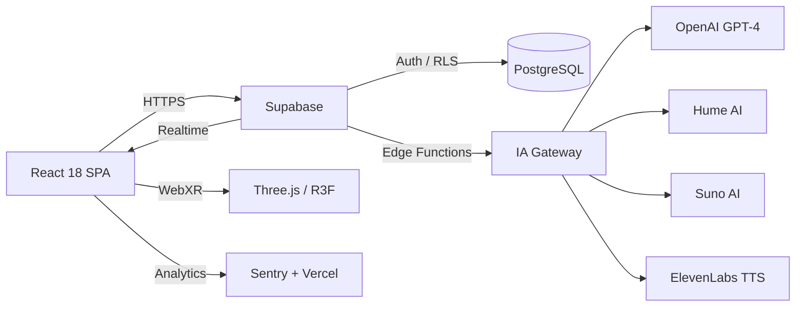

<h1 align="center">EmotionsCare</h1>

<p align="center">
  <strong>Prendre soin de celles et ceux qui prennent soin</strong>
</p>

<p align="center">
  Plateforme SaaS de bien-etre emotionnel concue pour les professionnels de sante.<br/>
  Intelligence artificielle, gamification et therapies digitales au service du mieux-etre.
</p>

<p align="center">
  <a href="https://www.typescriptlang.org/"></a>
  <a href="https://react.dev/"></a>
  <a href="https://supabase.com/"></a>
  <a href="./LICENSE"></a>
</p>

---

## Vision

EmotionsCare est ne d'un constat : les soignants prennent soin des autres, mais personne ne prend soin d'eux. La plateforme combine analyse emotionnelle par IA, exercices therapeutiques interactifs et gamification pour offrir un accompagnement continu, accessible et engageant. Notre ambition est de devenir la reference du bien-etre emotionnel en milieu hospitalier et en formation medicale.

---

## Fonctionnalites

**Analyse emotionnelle IA** — Scan facial temps reel (Hume AI, MediaPipe), analyse textuelle et vocale pour objectiver l'etat emotionnel. Les resultats alimentent un tableau de bord personnalise avec tendances et recommandations proactives.

**Coach IA Nyvee** — Un accompagnateur virtuel disponible 24/7, propulse par GPT-4 et ElevenLabs TTS. Il propose des micro-gestes adaptes au contexte, des exercices de respiration guides (coherence cardiaque, 4-7-8, box breathing) et un journal emotionnel avec analyse de sentiment.

**Therapies digitales immersives** — Environnements 3D (Three.js / WebXR) pour la meditation guidee, musicotherapie generative via Suno AI, galerie VR apaisante et filtres AR. Chaque module s'adapte au profil emotionnel de l'utilisateur.

**Gamification complete** — Systeme XP a 20 niveaux, 50+ badges, streaks, tournois hebdomadaires, guildes avec chat temps reel et defis quotidiens generes par IA. L'engagement transforme le bien-etre en habitude.

**Evaluations cliniques validees** — PHQ-9 (depression), GAD-7 (anxiete), PSS-10 (stress), WEMWBS (bien-etre), K6 (detresse psychologique) et evaluation burnout. Suivi longitudinal avec export RGPD.

**Module B2B** — Dashboard RH avec heatmap emotionnelle, rapports automatises, gestion d'equipes, SSO/SCIM, prevention burnout et hub bien-etre institutionnel. Concu pour les hopitaux, cliniques et ecoles de medecine.

---

## Architecture



Le frontend React communique exclusivement avec Supabase, qui orchestre l'authentification (email, OAuth, magic link), le stockage et les 272+ Edge Functions Deno. Ces fonctions servent de proxy securise vers les APIs d'IA externes, garantissant que les cles ne transitent jamais cote client.

---

## Stack technique

| Couche | Technologies |
|--------|-------------|
| **Frontend** | React 18, TypeScript strict, Vite 5, Tailwind CSS 3, shadcn/ui, Framer Motion |
| **State** | TanStack Query v5 (serveur), Zustand (client), React Hook Form + Zod |
| **3D / VR** | Three.js, React Three Fiber, WebXR, Post-processing |
| **Backend** | Supabase (PostgreSQL, Auth, Storage, Realtime, Edge Functions) |
| **IA** | OpenAI GPT-4, Hume AI, Suno AI, ElevenLabs, MediaPipe, Hugging Face |
| **Services** | Fastify micro-services (9), Kysely ORM, Rate limiting, JWT |
| **Infra** | Vercel (CDN), Sentry (monitoring), Lighthouse CI, GitHub Actions |
| **Tests** | Vitest, Playwright E2E, Testing Library, axe-core (a11y) |
| **i18n** | i18next (FR / EN / DE) |

---

## Demarrage rapide

```bash
# Cloner le depot
git clone https://github.com/laeticiamng/emotionscare.git
cd emotionscare

# Installer les dependances
npm install --legacy-peer-deps

# Configurer l'environnement
cp .env.example .env.local
# Renseigner VITE_SUPABASE_URL et VITE_SUPABASE_ANON_KEY

# Lancer en developpement
npm run dev
```

L'application demarre sur `http://localhost:8080`. Les Edge Functions necessitent un projet Supabase configure separement (`supabase start` pour le developpement local).

---

## Roadmap

| Jalon | Description | Horizon |
|-------|-------------|---------|
| **v1.3 — Pilote hospitalier** | Deploiement en conditions reelles dans 2 etablissements partenaires, collecte de feedback terrain | T3 2026 |
| **v1.4 — IA proactive** | Recommandations contextuelles basees sur les signaux cliniques, micro-gestes personnalises en temps reel | T4 2026 |
| **v2.0 — Marketplace** | Ouverture aux therapeutes tiers pour publier des contenus (meditations, exercices, programmes) | T1 2027 |
| **v2.1 — Mobile natif** | Applications iOS et Android via React Native, notifications push et mode hors-ligne | T2 2027 |

---

## Licence

Ce projet est la propriete de **EmotionsCare SASU**. Tous droits reserves.

**Contact** — [contact@emotionscare.com](mailto:contact@emotionscare.com)

**Site** — [emotionscare.com](https://emotionscare.com)
