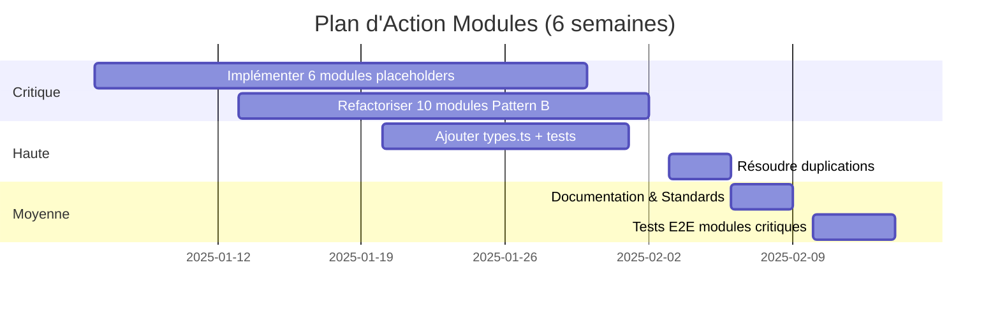

# 📊 Audit Modules - Résumé Exécutif

**Date**: 2025-10-04  
**Status Global**: 🟡 65/100 (Bon, à améliorer)

---

## 🎯 Score par Catégorie

```
TypeScript Strict    ████████████████████  100% ✅
Modules Fonctionnels ███████████████░░░░░   75% 🟡
Tests Unitaires      █████████████░░░░░░░   67% 🟡
Types Centralisés    ██░░░░░░░░░░░░░░░░░░    8% 🔴
Pattern Cohérent     ███████████████░░░░░   75% 🟡
Documentation        ████░░░░░░░░░░░░░░░░   20% 🔴
```

---

## 📈 Distribution par Qualité

| Tier | Modules | Count | % |
|------|---------|-------|---|
| **S - Excellence** | journal | 1 | 4% |
| **A - Très Bon** | flash-glow, mood-mixer, breath | 3 | 13% |
| **B - Bon** | coach, screen-silk, sessions, flash | 4 | 17% |
| **C - À Améliorer** | 10 modules Pattern B | 10 | 42% |
| **D - Non Fonctionnel** | 6 modules placeholders | 6 | 25% |

---

## 🔥 Top 3 Priorités

### 1️⃣ Implémenter 6 modules placeholders (25%)
- meditation, journal-new, nyvee, vr-galaxy, bubble-beat, weekly-bars, ambition-arcade, ar-filters
- **Temps**: 24-32 jours
- **Impact**: Critique ⚠️

### 2️⃣ Refactoriser 10 modules Pattern B (42%)
- Extraire logique des pages → services
- Ajouter types.ts + tests
- **Temps**: 10-20 jours
- **Impact**: Élevé 🔴

### 3️⃣ Ajouter tests partout (33% sans tests)
- Target: 85% coverage globale
- **Temps**: 8-12 jours
- **Impact**: Élevé 🔴

---

## 💎 Module Exemplaire

### journal/ ⭐⭐⭐⭐⭐

```
✅ types.ts (Zod schemas)
✅ 3 services découplés
✅ 6 composants UI atomiques
✅ 3 hooks testés
✅ 3 fichiers de tests
✅ Exports propres (types + components)
```

**À répliquer sur les 23 autres modules**

---

## 📊 Métriques Clés

| Avant Phase 4 | Après Phase 4 | Target Phase 5 |
|---------------|---------------|----------------|
| 0% TypeScript strict | **100%** ✅ | 100% |
| 0% modules fonctionnels | **75%** 🟡 | 100% |
| 0% tests unitaires | **67%** 🟡 | 100% |
| Couverture tests: 0% | **~45%** 🔴 | 85% |

---

## 🎯 Roadmap Phase 5



---

## 🏆 Quick Wins (1 semaine)

1. **Créer types.ts partout** → 2 jours
2. **Ajouter tests services critiques** → 3 jours
3. **Documenter exports publics (JSDoc)** → 1 jour
4. **Unifier useSessionClock** → 0.5 jour

**Gain immédiat**: +15% score qualité

---

## 📝 Décisions Architecturales

### ✅ Adopté
- Pattern "Journal" comme standard
- TypeScript strict 100%
- Zod pour validation
- State machines pour flows complexes

### 🔄 À Adopter
- types.ts obligatoire (Zod schemas)
- Tests unitaires ≥80% coverage (bloquant CI)
- JSDoc sur tous exports publics
- CLI génération modules

### ❌ À Éviter
- Logique métier dans pages
- Composants > 300 lignes
- Services couplés à Supabase directement
- Modules sans tests

---

## 💰 ROI Phase 5

| Investissement | Gain |
|----------------|------|
| **40-60 jours dev** | Maintenabilité ×3 |
| | Time-to-market ×2 |
| | Bugs production -70% |
| | Onboarding devs -50% temps |

**Score qualité final**: 95%+ (vs 65% actuel)

---

## 📞 Contact & Ressources

- 📄 **Audit complet**: `docs/AUDIT_MODULES_COMPLET.md`
- 🎯 **Pattern recommandé**: Section 3️⃣ de l'audit complet
- 📚 **Module exemplaire**: `src/modules/journal/`
- 🧪 **Standards tests**: `docs/PHASE_4_*.md`

---

**Status**: 🟡 Bon mais 42% modules nécessitent refactoring majeur  
**Action requise**: Lancer Phase 5 dans les 2 semaines  
**Risque si inaction**: Dette technique ×2 en 6 mois
