# PHASE 5 - MODULE 11 : VR Nebula

**Module** : `src/modules/vr-nebula/`  
**Objectif** : Expérience VR de respiration et cohérence cardiaque  
**Statut** : ✅ Complété (Day 27)

---

## 📋 Vue d'ensemble

VR Nebula est un module d'expérience VR immersive combinant respiration guidée, cohérence cardiaque et feedback biométrique (HRV) dans des environnements spatiaux apaisants.

---

## 🏗️ Architecture

### Structure des fichiers

```
src/modules/vr-nebula/
├── types.ts                    # Schémas Zod & Types TypeScript
├── vrNebulaService.ts          # Business logic & API calls
├── useVRNebulaMachine.ts       # State machine React
├── index.ts                    # Exports publics
└── __tests__/
    └── types.test.ts           # Tests des schémas Zod (23 tests)
```

---

## 📊 Types & Schémas

### Enums principaux

```typescript
NebulaScene = 'galaxy' | 'ocean' | 'forest' | 'space' | 'aurora' | 'cosmos'
BreathingPattern = 'box' | 'coherence' | 'relax' | 'energize' | 'calm'
NebulaPhase = 'idle' | 'loading' | 'calibrating' | 'active' | 'paused' | 'completing' | 'completed' | 'error'
BreathPhase = 'inhale' | 'hold_in' | 'exhale' | 'hold_out'
```

### Breathing Patterns (Presets)

```typescript
const BREATH_PRESETS = {
  box:       { inhale: 4, hold_in: 4, exhale: 4, hold_out: 4 },    // Équilibre
  coherence: { inhale: 5, hold_in: 0, exhale: 5, hold_out: 0 },    // Cohérence cardiaque
  relax:     { inhale: 4, hold_in: 7, exhale: 8, hold_out: 0 },    // 4-7-8 relaxation
  energize:  { inhale: 3, hold_in: 0, exhale: 5, hold_out: 0 },    // Énergisant
  calm:      { inhale: 6, hold_in: 0, exhale: 6, hold_out: 0 },    // Calme profond
}
```

### Entités principales

#### VRNebulaSession
```typescript
{
  id: UUID
  user_id: UUID
  scene: NebulaScene
  breathing_pattern: BreathingPattern
  duration_s: number
  resp_rate_avg?: number              // Respirations/min
  hrv_pre?: number                    // HRV avant session
  hrv_post?: number                   // HRV après session
  rmssd_delta?: number                // Gain HRV (calculé)
  coherence_score?: number (0-100)    // Score cohérence (calculé)
  cycles_completed: number
  vr_mode: boolean
  created_at: string
  updated_at: string
}
```

#### BreathTiming
```typescript
{
  inhale: number (1-10 seconds)
  hold_in: number (0-10 seconds)
  exhale: number (1-15 seconds)
  hold_out: number (0-10 seconds)
}
```

#### NebulaConfig
```typescript
{
  scene: NebulaScene (default: 'galaxy')
  pattern: BreathingPattern (default: 'coherence')
  duration_minutes: number (1-30, default: 10)
  vr_mode: boolean (default: true)
  audio_enabled: boolean (default: true)
  haptic_feedback: boolean (default: true)
  custom_timing?: BreathTiming
}
```

---

## 🔧 Service API

### Session Management

#### `createSession(payload: CreateVRNebulaSession): Promise<VRNebulaSession>`
Crée une nouvelle session VR.

**Payload:**
```typescript
{
  scene: NebulaScene
  breathing_pattern: BreathingPattern
  vr_mode: boolean (default: true)
}
```

#### `completeSession(payload: CompleteVRNebulaSession): Promise<VRNebulaSession>`
Termine la session et calcule les métriques.

**Payload:**
```typescript
{
  session_id: UUID
  duration_s: number (>= 0)
  resp_rate_avg?: number
  hrv_pre?: number
  hrv_post?: number
  cycles_completed: number (default: 0)
}
```

**Auto-calculated:**
- `rmssd_delta = hrv_post - hrv_pre`
- `coherence_score = calculateCoherenceScore(resp_rate, rmssd_delta)`

#### `getSession(sessionId: string): Promise<VRNebulaSession>`
Récupère une session spécifique.

### Statistics

#### `getStats(): Promise<VRNebulaStats>`
Calcule les statistiques complètes.

**Retourne:**
```typescript
{
  total_sessions: number
  total_minutes: number
  total_breaths: number
  average_coherence: number (0-100)
  average_hrv_gain: number
  favorite_scene: NebulaScene | null
  favorite_pattern: BreathingPattern | null
  sessions_this_week: number
  sessions_this_month: number
  longest_session_minutes: number
  current_streak_days: number
}
```

#### `getRecentSessions(limit = 10): Promise<VRNebulaSession[]>`
Liste les sessions récentes.

---

## 🤖 State Machine

### États

```typescript
'idle'        → Aucune session active
'loading'     → Chargement de l'environnement VR
'calibrating' → Calibration (HRV baseline, 2s)
'active'      → Session en cours avec respiration guidée
'paused'      → Session en pause
'completing'  → Finalisation et sauvegarde
'completed'   → Session terminée (temporaire, 3s)
'error'       → Erreur survenue
```

### Actions

#### `startSession(scene, pattern, vrMode?)`
Démarre une nouvelle session VR.

**Flow:**
1. Crée la session en DB
2. Charge l'environnement (`loading`)
3. Calibre le système (`calibrating`, 2s)
4. Démarre respiration guidée (`active`)

**Transitions:**
- `idle` → `loading` → `calibrating` → `active`
- Démarre automatiquement les timers et cycles de respiration

#### `pauseSession()`
Met en pause la session.

**Transitions:**
- `active` → `paused`

**Effets:**
- Arrête les timers
- Arrête le cycle de respiration
- Garde le state en mémoire

#### `resumeSession()`
Reprend la session en pause.

**Transitions:**
- `paused` → `active`

**Effets:**
- Redémarre les timers
- Reprend le cycle de respiration

#### `completeSession(hrvPre?, hrvPost?)`
Termine et sauvegarde la session.

**Transitions:**
- `active` → `completing` → `completed` → `idle` (après 3s)

**Calculs automatiques:**
- Taux respiratoire moyen
- Delta HRV
- Score de cohérence

#### `updateHRV(hrv: number)`
Met à jour la mesure HRV en temps réel.

**Usage:** Appelé par capteur HRV externe.

#### `reset()`
Réinitialise la machine.

### Breath Cycle Management

Le state machine gère automatiquement les cycles de respiration:

```typescript
// Cycle automatique basé sur le pattern sélectionné
inhale (5s) → exhale (5s) → repeat...  // Coherence
inhale (4s) → hold (4s) → exhale (4s) → hold (4s) → repeat...  // Box
```

**Comportement:**
- Skip automatique des phases à 0 seconde
- Incrémente `breathCount` à chaque cycle complet
- Met à jour `currentBreathPhase` pour l'UI

### Hook Usage

```typescript
const {
  state,
  startSession,
  pauseSession,
  resumeSession,
  completeSession,
  updateHRV,
  reset,
} = useVRNebulaMachine();

// Démarrer session
await startSession('galaxy', 'coherence', true);

// State disponible
state.phase              // État actuel
state.session            // Session en cours
state.currentBreathPhase // Phase respiration actuelle
state.breathCount        // Nombre de cycles
state.elapsedSeconds     // Temps écoulé
state.currentHRV         // HRV actuel
state.coherenceLevel     // Niveau de cohérence
state.error              // Message d'erreur

// Pause/Resume
pauseSession();
resumeSession();

// Terminer avec mesures HRV
await completeSession(50, 75);
```

---

## 🎯 Intégration Supabase

### Table: `vr_nebula_sessions`

```sql
CREATE TABLE vr_nebula_sessions (
  id UUID PRIMARY KEY DEFAULT gen_random_uuid(),
  user_id UUID REFERENCES auth.users NOT NULL,
  scene TEXT NOT NULL,
  breathing_pattern TEXT NOT NULL,
  duration_s INTEGER DEFAULT 0,
  resp_rate_avg NUMERIC,
  hrv_pre INTEGER,
  hrv_post INTEGER,
  rmssd_delta INTEGER,
  coherence_score INTEGER CHECK (coherence_score >= 0 AND coherence_score <= 100),
  cycles_completed INTEGER DEFAULT 0,
  vr_mode BOOLEAN DEFAULT true,
  created_at TIMESTAMPTZ DEFAULT now(),
  updated_at TIMESTAMPTZ DEFAULT now()
);

CREATE INDEX idx_vr_nebula_user ON vr_nebula_sessions(user_id);
CREATE INDEX idx_vr_nebula_created ON vr_nebula_sessions(created_at DESC);
```

### RLS Policies

```sql
CREATE POLICY "vr_nebula_user_manage"
ON vr_nebula_sessions
FOR ALL
USING (auth.uid() = user_id);
```

### Trigger: Auto-calculate metrics

```sql
CREATE OR REPLACE FUNCTION calc_vr_nebula()
RETURNS TRIGGER
LANGUAGE plpgsql
SECURITY DEFINER
SET search_path = public
AS $$
BEGIN
  NEW.rmssd_delta := COALESCE(NEW.hrv_post, 0) - COALESCE(NEW.hrv_pre, 0);
  
  IF NEW.resp_rate_avg IS NOT NULL THEN
    NEW.coherence_score := GREATEST(0, 100 - ABS(NEW.resp_rate_avg * 1.0 - 5.5) * 10);
  ELSE
    NEW.coherence_score := NULL;
  END IF;
  
  RETURN NEW;
END;
$$;

CREATE TRIGGER vr_nebula_calc_metrics
BEFORE INSERT OR UPDATE ON vr_nebula_sessions
FOR EACH ROW
EXECUTE FUNCTION calc_vr_nebula();
```

---

## 📱 Composants UI (à implémenter)

### NebulaViewer
Rendu 3D de l'environnement VR avec Three.js/React-Three-Fiber.

### BreathGuide
Visualisation animée du cycle de respiration.

### HRVMonitor
Affichage en temps réel des métriques HRV.

### CoherenceIndicator
Jauge de cohérence cardiaque.

### SceneSelector
Sélecteur d'environnements VR.

---

## ✅ Tests

### Coverage

- ✅ Validation des schémas Zod (23 tests)
- ✅ Enums (scenes, patterns, phases)
- ✅ Structures de données (session, config, timing)
- ✅ Helpers (getBreathTiming, calculateCycleDuration, calculateCoherenceScore)
- ✅ Contraintes (duration, coherence score)

**Commande:**
```bash
npm test src/modules/vr-nebula/__tests__
```

---

## 🔄 Flux utilisateur typique

```mermaid
sequenceDiagram
    participant U as Utilisateur
    participant SM as State Machine
    participant S as Service
    participant HRV as HRV Sensor
    participant DB as Supabase

    U->>SM: startSession('galaxy', 'coherence')
    SM->>S: createSession()
    S->>DB: INSERT session
    DB-->>S: Session created
    SM-->>U: État: loading
    
    Note over SM: Calibration 2s
    
    SM-->>U: État: calibrating
    SM->>HRV: Measure baseline HRV
    HRV-->>SM: hrv_pre = 50
    
    SM-->>U: État: active
    
    loop Breath Cycles
        SM-->>U: Phase: inhale (5s)
        SM-->>U: Phase: exhale (5s)
        SM-->>U: breathCount++
        HRV->>SM: updateHRV(current)
        SM-->>U: Affichage metrics temps réel
    end
    
    Note over U: 10 minutes...
    
    U->>SM: completeSession()
    SM->>HRV: Measure final HRV
    HRV-->>SM: hrv_post = 75
    
    SM->>S: completeSession(data)
    S->>DB: UPDATE session + calculs
    DB-->>S: Session completed
    SM-->>U: État: completed
    
    Note over SM: Auto-reset après 3s
    
    SM-->>U: État: idle
```



---

## 📊 Algorithmes clés

### Calcul du score de cohérence

```typescript
function calculateCoherenceScore(respRate: number, hrvDelta: number): number {
  // Cohérence optimale autour de 5.5-6 respirations/min
  const rateScore = Math.max(0, 100 - Math.abs(respRate - 5.5) * 10);
  
  // Gain HRV positif améliore le score
  const hrvScore = Math.min(100, Math.max(0, hrvDelta));
  
  // Pondération: 60% taux respiratoire, 40% gain HRV
  return Math.round((rateScore * 0.6 + hrvScore * 0.4));
}
```

**Exemples:**
- `respRate=5.5, hrvDelta=30` → score ≈ 72
- `respRate=6.0, hrvDelta=20` → score ≈ 63
- `respRate=8.0, hrvDelta=-5` → score ≈ 26

### Gestion des cycles de respiration

```typescript
// Exemple: Coherence (5-0-5-0)
phases = ['inhale', 'hold_in', 'exhale', 'hold_out']
durations = [5s, 0s, 5s, 0s]

// Skip phases à 0
while (duration === 0) skip();

// Cycle complet = 10 secondes
// 6 cycles/min = taux respiratoire optimal
```

---

## 🎨 Scènes VR disponibles

### Galaxy
Nébuleuse spatiale avec particules lumineuses

### Ocean
Profondeurs océaniques avec bioluminescence

### Forest
Forêt mystique avec rayons de lumière

### Space
Espace profond avec étoiles et galaxies

### Aurora
Aurores boréales dans ciel nordique

### Cosmos
Voyage à travers différentes nébuleuses

---

## 🔐 Sécurité

- ✅ RLS activé sur `vr_nebula_sessions`
- ✅ Authentification requise pour toutes les opérations
- ✅ Validation Zod côté client et serveur
- ✅ Calculs métriques en trigger DB (immutable)
- ✅ Gestion des erreurs avec Sentry

---

## 📚 Dépendances

- `zod` - Validation de schémas
- `@sentry/react` - Error tracking
- `@/integrations/supabase/client` - Database
- `@/hooks/use-toast` - Notifications utilisateur
- `three` / `@react-three/fiber` - Rendu 3D (à ajouter)
- `@react-three/xr` - Support WebXR VR (déjà installé)

---

## 🚀 Prochaines étapes

- [ ] Implémentation des composants 3D avec Three.js
- [ ] Intégration capteur HRV (Polar H10, Apple Watch)
- [ ] Support WebXR pour casques VR
- [ ] Audio binaural spatialisé
- [ ] Modes multi-joueurs synchronisés
- [ ] AI adaptatif du rythme respiratoire
- [ ] Export données HRV pour analyse
- [ ] Integration avec module Bounce Back

---

## 📝 Notes techniques

### Optimisations appliquées

1. **Timers précis**: `setInterval` pour elapsed time, `setTimeout` pour phases
2. **Cleanup automatique**: Timers cleared on unmount
3. **Calculs DB-side**: Triggers pour metrics dérivées
4. **State minimal**: Seules données essentielles en mémoire

### Considérations de performance

- Rendu 3D: Target 90 FPS pour VR
- Update HRV: Max 10 Hz (100ms interval)
- Breath cycle: Précision ±50ms acceptable
- DB writes: Uniquement à la fin de session
- WebXR latency: <20ms motion-to-photon

---

**Statut**: ✅ Architecture complète - Prêt pour intégration 3D/VR  
**Date**: 2025-01-27  
**Version**: 1.0.0
