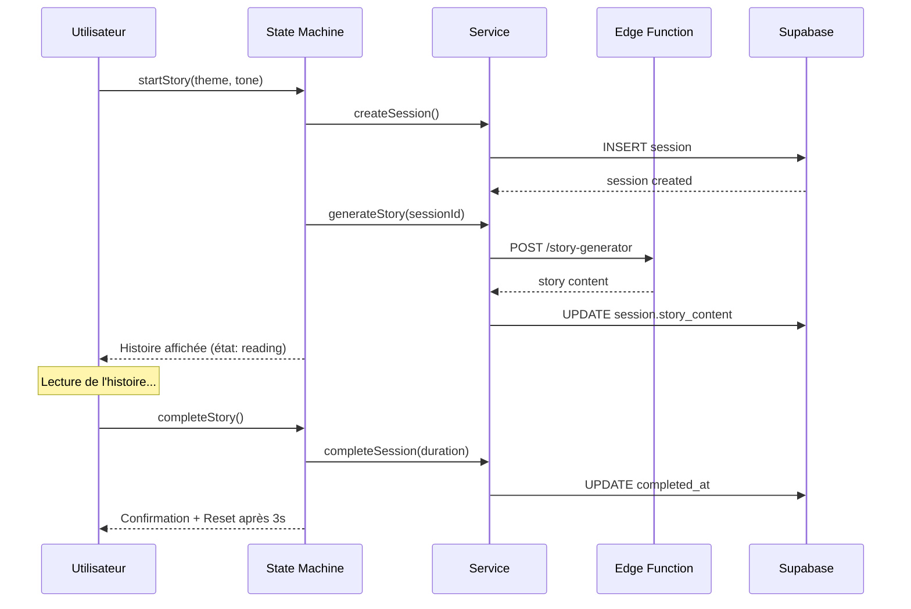

# PHASE 5 - MODULE 9 : Story Synth

**Module** : `src/modules/story-synth/`  
**Objectif** : Narration thérapeutique immersive avec génération de contenu personnalisé  
**Statut** : ✅ Complété (Day 25)

---

## 📋 Vue d'ensemble

Story Synth est un module de narration thérapeutique qui génère des histoires personnalisées basées sur le contexte émotionnel de l'utilisateur. Il combine génération de contenu, ambiance sonore et suivi de lecture pour créer une expérience immersive.

---

## 🏗️ Architecture

### Structure des fichiers

```
src/modules/story-synth/
├── types.ts                    # Schémas Zod & Types TypeScript
├── storySynthService.ts        # Business logic & API calls
├── useStorySynthMachine.ts     # State machine React
├── StorySynthPage.tsx          # Page principale
├── index.tsx                   # Exports publics
└── __tests__/
    └── types.test.ts           # Tests des schémas Zod
```

---

## 📊 Types & Schémas

### Enums principaux

```typescript
StoryTheme = 'calme' | 'aventure' | 'poetique' | 'mysterieux' | 'romance' | 'introspection' | 'nature'
StoryTone = 'apaisant' | 'encourageant' | 'contemplatif' | 'joyeux' | 'nostalgique' | 'esperant'
StoryPov = 'je' | 'il' | 'elle' | 'nous'
StoryStyle = 'sobre' | 'lyrique' | 'journal' | 'dialogue'
StorySynthPhase = 'idle' | 'generating' | 'reading' | 'pausing' | 'completed' | 'error'
```

### Entités principales

#### StoryContent
```typescript
{
  title: string
  paragraphs: Array<{
    id: string
    text: string
    emphasis?: 'normal' | 'soft' | 'strong'
  }>
  estimated_duration_seconds?: number
  ambient_music?: string
}
```

#### StorySynthSession
```typescript
{
  id: UUID
  user_id: UUID
  theme: StoryTheme
  tone: StoryTone
  user_context?: string
  story_content?: StoryContent
  reading_duration_seconds: number
  completed_at?: string
  created_at: string
  updated_at: string
}
```

#### StoryGenerationConfig
```typescript
{
  theme: StoryTheme
  tone: StoryTone
  pov: StoryPov              // default: 'je'
  style: StoryStyle          // default: 'sobre'
  protagonist: string        // default: 'Alex'
  location: string           // default: 'la ville'
  length: number (3-10)      // default: 5
  seed?: string
  user_context?: string
}
```

---

## 🔧 Service API

### Session Management

#### `createSession(payload: CreateStorySynthSession): Promise<StorySynthSession>`
Crée une nouvelle session de narration.

**Payload:**
```typescript
{
  theme: StoryTheme
  tone: StoryTone
  user_context?: string
}
```

#### `completeSession(payload: CompleteStorySynthSession): Promise<StorySynthSession>`
Marque une session comme terminée et enregistre la durée de lecture.

**Payload:**
```typescript
{
  session_id: UUID
  reading_duration_seconds: number (>= 0)
}
```

### Story Generation

#### `generateStory(sessionId: string): Promise<StoryContent>`
Génère le contenu narratif via l'edge function `story-generator`.

**Retourne:**
- Titre personnalisé
- Paragraphes avec emphase
- Durée estimée
- Musique d'ambiance suggérée

### Statistics

#### `getStats(): Promise<StorySynthStats>`
Récupère les statistiques de lecture de l'utilisateur.

**Retourne:**
```typescript
{
  total_stories_read: number
  total_reading_time_minutes: number
  favorite_theme: StoryTheme | null
  favorite_tone: StoryTone | null
  completion_rate: number
}
```

#### `getRecentSessions(limit = 10): Promise<StorySynthSession[]>`
Liste les sessions récentes de l'utilisateur.

---

## 🤖 State Machine

### États

```typescript
'idle'       → Aucune session active
'generating' → Génération du contenu en cours
'reading'    → Lecture active de l'histoire
'pausing'    → Pause temporaire
'completed'  → Session terminée avec succès
'error'      → Erreur survenue
```

### Actions

#### `startStory(theme, tone, userContext?)`
Démarre une nouvelle session et génère l'histoire.

**Transitions:**
- `idle` → `generating` → `reading` (succès)
- `idle` → `generating` → `error` (échec)

#### `completeStory()`
Termine la session en cours et enregistre les données.

**Transitions:**
- `reading` → `completed` → `idle` (après 3s)
- `reading` → `error` (échec)

#### `resetStory()`
Réinitialise la machine à l'état initial.

**Transitions:**
- `*` → `idle`

### Hook Usage

```typescript
const { state, startStory, completeStory, resetStory } = useStorySynthMachine();

// Démarrer une session
await startStory('calme', 'apaisant', 'Besoin de relaxation');

// State disponible
state.phase              // État actuel
state.session            // Session en cours
state.currentStory       // Contenu de l'histoire
state.startTime          // Timestamp de début
state.error              // Message d'erreur éventuel
```

---

## 🎯 Intégration Supabase

### Table: `story_synth_sessions`

```sql
CREATE TABLE story_synth_sessions (
  id UUID PRIMARY KEY DEFAULT gen_random_uuid(),
  user_id UUID REFERENCES auth.users NOT NULL,
  theme TEXT NOT NULL,
  tone TEXT NOT NULL,
  user_context TEXT,
  story_content JSONB,
  reading_duration_seconds INTEGER DEFAULT 0,
  completed_at TIMESTAMPTZ,
  created_at TIMESTAMPTZ DEFAULT now(),
  updated_at TIMESTAMPTZ DEFAULT now()
);
```

### RLS Policies

```sql
-- Users manage their own sessions
CREATE POLICY "story_sessions_user_manage"
ON story_synth_sessions
FOR ALL
USING (auth.uid() = user_id);
```

### Edge Function: `story-generator`

**Endpoint:** `/functions/v1/story-generator`

**Request:**
```json
{
  "session_id": "uuid"
}
```

**Response:**
```json
{
  "story": {
    "title": "Un moment de calme",
    "paragraphs": [
      {
        "id": "p1",
        "text": "Il était une fois...",
        "emphasis": "soft"
      }
    ],
    "estimated_duration_seconds": 180,
    "ambient_music": "calm-piano"
  }
}
```

---

## 📱 Composants UI

### StorySynthPage

Page principale avec formulaire de configuration et affichage de l'histoire.

**Fonctionnalités:**
- Sélection thème, ton, POV, style
- Configuration du protagoniste et lieu
- Contrôle de longueur (3-10 paragraphes)
- Ambiance sonore optionnelle
- Export en fichier texte
- Historique des sessions

---

## ✅ Tests

### Coverage

- ✅ Validation des schémas Zod (14 tests)
- ✅ Enums (themes, tones, POV, styles)
- ✅ Structures de données (session, content, stats)
- ✅ Configurations de génération
- ✅ États de la machine

**Commande:**
```bash
npm test src/modules/story-synth/__tests__
```

---

## 🔄 Flux utilisateur typique



---

## 🎨 Personnalisation

### Ambiance sonore

Fichiers audio suggérés par thème:
- **calme**: `/audio/lofi-120.mp3`
- **nature**: `/audio/rain-soft.mp3`
- **aventure**: `/audio/epic-ambient.mp3`

### Génération de contenu

Le prompt de génération combine:
- Thème et ton sélectionnés
- Contexte utilisateur (optionnel)
- Style narratif
- Point de vue
- Longueur cible

---

## 📊 Métriques & Analytics

### Stats disponibles

- Nombre total d'histoires lues
- Temps de lecture cumulé
- Thème préféré
- Ton préféré
- Taux de complétion

### Événements à tracker

- `story_generated`: Nouvelle histoire créée
- `story_completed`: Lecture terminée
- `story_exported`: Export fichier texte
- `story_interrupted`: Lecture abandonnée

---

## 🔐 Sécurité

- ✅ RLS activé sur `story_synth_sessions`
- ✅ Authentification requise pour toutes les opérations
- ✅ Validation Zod côté client et serveur
- ✅ Gestion des erreurs avec Sentry

---

## 📚 Dépendances

- `zod` - Validation de schémas
- `@sentry/react` - Error tracking
- `@/integrations/supabase/client` - Database & Functions
- `@/hooks/use-toast` - Notifications utilisateur

---

## 🚀 Prochaines étapes

- [ ] Intégration avec module AI Coach
- [ ] Bibliothèque de templates d'histoires
- [ ] Mode collaboratif (histoires partagées)
- [ ] Analyse sentiment pendant la lecture
- [ ] Recommandations basées sur l'historique

---

## 📝 Notes techniques

### Optimisations appliquées

1. **Génération côté serveur**: Edge function pour garder la logique AI confidentielle
2. **Caching**: Stories générées stockées en JSONB
3. **Streaming potentiel**: Architecture prête pour streaming de paragraphes
4. **Offline support**: Stories peuvent être exportées en texte

### Considérations de performance

- Génération AI: ~3-5 secondes
- Limite de longueur: 10 paragraphes max
- Taille moyenne d'une story: ~2-3 KB
- Sessions archivées après 90 jours

---

**Statut**: ✅ Architecture complète - Prêt pour intégration
**Date**: 2024-01-25
**Version**: 1.0.0
