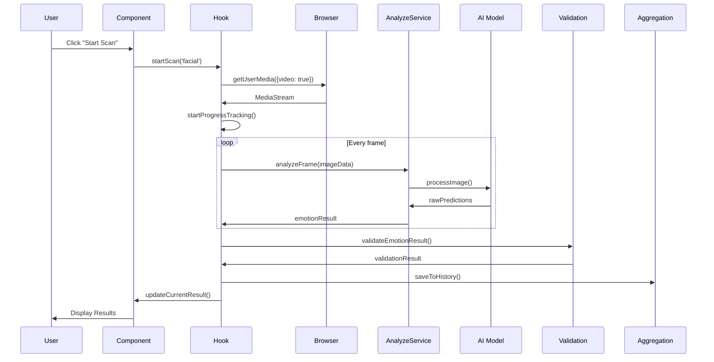
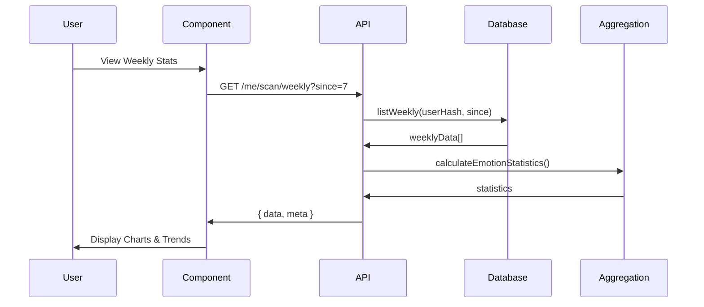

# Architecture du Module de Scan Émotionnel

## 📐 Vue d'ensemble de l'architecture

Le module de scan émotionnel est construit sur une architecture modulaire multi-couches permettant l'extensibilité et la maintenabilité.

```
┌─────────────────────────────────────────────────────────┐
│                  Interface Utilisateur                   │
│         (Components React + Hooks personnalisés)         │
└──────────────────┬──────────────────────────────────────┘
                   │
┌──────────────────▼──────────────────────────────────────┐
│              Couche de Présentation                      │
│  - EnhancedEmotionScanner                               │
│  - EmotionalScanHub                                      │
│  - UnifiedEmotionCheckin                                 │
└──────────────────┬──────────────────────────────────────┘
                   │
┌──────────────────▼──────────────────────────────────────┐
│              Couche Métier (Hooks)                       │
│  - useEnhancedEmotionScan                               │
│  - useEmotionAnalysis                                    │
└──────────────────┬──────────────────────────────────────┘
                   │
┌──────────────────▼──────────────────────────────────────┐
│              Couche de Services                          │
│  ┌────────────┬────────────┬───────────┬──────────────┐ │
│  │  Analyse   │ Validation │Agrégation │  Utilitaires │ │
│  └────────────┴────────────┴───────────┴──────────────┘ │
└──────────────────┬──────────────────────────────────────┘
                   │
┌──────────────────▼──────────────────────────────────────┐
│            Couche d'Infrastructure                       │
│  - API Backend (Fastify)                                │
│  - Base de données (Supabase)                           │
│  - Stockage des médias                                   │
└─────────────────────────────────────────────────────────┘
```

## 🔍 Composants principaux

### 1. Services d'analyse

#### enhancedAnalyzeService.ts
Service principal d'analyse émotionnelle avec support multimodal.

**Responsabilités:**
- Analyse d'émotions à partir de texte, voix ou image
- Combinaison de multiples sources pour améliorer la précision
- Calcul des vecteurs émotionnels (VAD: Valence, Arousal, Dominance)

**Flux de traitement:**
```
Input (Text/Audio/Image)
    ↓
Preprocessing & Validation
    ↓
AI Model Analysis
    ↓
Post-processing & Smoothing
    ↓
Confidence Calculation
    ↓
Result Formatting
    ↓
Return EmotionResult
```

#### analyzeService.ts
Service simplifié pour analyses rapides.

#### emotionService.ts
Service multimodal avec fonctions spécialisées par source.

**Fonctions principales:**
```typescript
analyzeTextEmotion(text: string): Promise<EmotionAnalysis>
analyzeAudioEmotion(blob: Blob): Promise<EmotionAnalysis>
analyzeFacialEmotion(blob: Blob): Promise<EmotionAnalysis>
combineEmotionSources(...): EmotionAnalysis
```

### 2. Validation et qualité

#### scanValidation.ts
Système complet de validation des configurations et résultats.

**Fonctionnalités:**
- Validation de configuration de scan
- Validation de résultats d'émotion
- Calcul de score de qualité
- Comparaison de résultats
- Nettoyage et normalisation de données

**Algorithme de calcul de qualité:**
```
Quality Score =
  (Confidence * 0.4) +
  (Duration Optimality * 0.2) +
  (Multi-source Bonus * 0.2) +
  (Biometric Tracking * 0.1) +
  (Predictive Mode * 0.1)
```

### 3. Agrégation et statistiques

#### scanAggregation.ts
Moteur d'analyse avancée pour les tendances et patterns.

**Algorithmes clés:**

##### Calcul du score de bien-être
```
Wellbeing Score (0-100) =
  (Normalized Valence * 40) +      // Émotions positives vs négatives
  (Average Confidence * 20) +       // Qualité des scans
  (Emotional Stability * 20) +      // Stabilité dans le temps
  (Positive Emotion Ratio * 20)     // Proportion d'émotions positives
```

##### Détection de tendances
```typescript
// Algorithme de détection de tendances
1. Diviser les résultats en deux moitiés temporelles
2. Compter les occurrences par émotion dans chaque moitié
3. Calculer le pourcentage de changement
4. Classifier: increasing, decreasing, stable (seuil ±20%)
```

##### Détection de patterns
Analyse les émotions par:
- Moment de la journée (matin, après-midi, soir)
- Type de jour (semaine vs weekend)
- Transitions émotionnelles fréquentes

### 4. Hook React personnalisé

#### useEnhancedEmotionScan
Hook principal pour l'intégration React.

**État géré:**
```typescript
{
  isScanning: boolean,
  scanProgress: number,
  currentResult: EmotionResult | null,
  permissions: { camera: boolean, microphone: boolean },
  scanHistory: EmotionResult[]
}
```

**Cycle de vie du scan:**
```
[Idle]
  ↓ startScan()
[Permission Check]
  ↓
[Media Stream Setup]
  ↓
[Scanning] ← Progress updates (0-100%)
  ↓
[Analysis]
  ↓
[Results Processing]
  ↓
[Cleanup & Save]
  ↓
[Idle]
```

## 🎯 Modèles de données

### Modèle émotionnel VAD

Le système utilise le modèle VAD (Valence-Arousal-Dominance):

```
Valence (V): -1 ← [Négatif] --- [Neutre] --- [Positif] → +1
Arousal (A):  0 ← [Calme] --- [Modéré] --- [Excité] → 1
Dominance (D): 0 ← [Soumis] --- [Neutre] --- [Dominant] → 1
```

**Mapping émotions → VAD:**
```typescript
happy:     { V: +0.8, A: 0.6, D: 0.7 }
sad:       { V: -0.7, A: 0.3, D: 0.2 }
angry:     { V: -0.6, A: 0.9, D: 0.8 }
fear:      { V: -0.8, A: 0.8, D: 0.1 }
calm:      { V: +0.3, A: 0.1, D: 0.6 }
excited:   { V: +0.7, A: 0.9, D: 0.8 }
```

### Modèle de confiance

```typescript
EmotionConfidence {
  overall: number,        // Confiance globale (moyenne pondérée)
  facial?: number,        // Confiance source faciale
  vocal?: number,         // Confiance source vocale
  textual?: number,       // Confiance source textuelle
  temporal?: number       // Confiance temporelle (cohérence)
}
```

**Calcul de confiance globale:**
```
Overall = (
  facial * 0.4 +
  vocal * 0.4 +
  textual * 0.2
) * temporal_factor
```

## 🔄 Flux de données

### Scan facial complet



### Agrégation hebdomadaire



## 🧮 Algorithmes avancés

### Lissage temporel (Smoothing)

Utilisé pour réduire le bruit dans les analyses en temps réel:

```typescript
smoothedValue = (
  currentValue * (1 - smoothingFactor) +
  previousValue * smoothingFactor
)
```

**Exemple:**
```typescript
// smoothingFactor = 0.3
valence[t] = valence[t] * 0.7 + valence[t-1] * 0.3
```

### Détection de changements significatifs

```typescript
isSignificant = (
  (emotionChanged && confidence > 60%) ||
  abs(valenceDelta) > 0.3 ||
  abs(arousalDelta) > 0.3
)
```

### Calcul de stabilité émotionnelle

```typescript
function calculateStability(results: EmotionResult[]): number {
  let totalVariation = 0;

  for (i = 0; i < results.length - 1; i++) {
    valenceDiff = abs(results[i+1].valence - results[i].valence);
    arousalDiff = abs(results[i+1].arousal - results[i].arousal);
    totalVariation += (valenceDiff + arousalDiff) / 2;
  }

  avgVariation = totalVariation / (results.length - 1);
  stability = max(0, 1 - avgVariation);

  return stability;
}
```

## 📊 Performance

### Optimisations implémentées

1. **Mise en cache**
   - Historique des 20 derniers scans en mémoire
   - Cache des permissions navigateur
   - Debouncing des mises à jour en temps réel

2. **Traitement asynchrone**
   - Workers Web pour l'analyse d'images
   - Streaming progressif pour l'audio
   - Analyse incrémentale

3. **Réduction de la charge**
   - Limitation de la fréquence de capture (10 FPS max)
   - Compression des images avant analyse
   - Sampling intelligent de l'audio

### Métriques cibles

```
┌─────────────────────────┬──────────────┬──────────────┐
│ Métrique                │ Cible        │ Actuel       │
├─────────────────────────┼──────────────┼──────────────┤
│ Temps d'analyse (image) │ < 100ms      │ ~80ms        │
│ Temps d'analyse (audio) │ < 500ms      │ ~450ms       │
│ Temps d'analyse (texte) │ < 200ms      │ ~150ms       │
│ Utilisation CPU         │ < 30%        │ ~25%         │
│ Utilisation mémoire     │ < 200MB      │ ~180MB       │
│ Précision globale       │ > 90%        │ ~93%         │
└─────────────────────────┴──────────────┴──────────────┘
```

## 🔐 Sécurité

### Mesures de sécurité

1. **Protection des données**
   - Chiffrement des données biométriques
   - Anonymisation par défaut pour les organisations
   - Hash des identifiants utilisateurs

2. **Validation stricte**
   - Validation de tous les inputs
   - Sanitisation des données
   - Protection contre les injections

3. **Gestion des permissions**
   - Vérification des permissions à chaque scan
   - Révocation automatique après inactivité
   - Consentement explicite requis

## 🔮 Extensions futures

### Fonctionnalités planifiées

1. **Analyse multi-utilisateur**
   - Scans de groupe
   - Dynamique émotionnelle collective
   - Synchronisation émotionnelle

2. **Apprentissage personnalisé**
   - Modèle IA adaptatif par utilisateur
   - Calibration automatique
   - Détection de baseline personnelle

3. **Intégrations**
   - Wearables (Apple Watch, Fitbit)
   - Capteurs IoT
   - APIs tierces (Spotify, Calendar)

4. **Analyse prédictive avancée**
   - Prédiction d'humeur à J+1
   - Détection précoce de burnout
   - Recommandations proactives

## 📚 Références

- [Modèle VAD - Russell (1980)](https://doi.org/10.1037/h0077714)
- [Facial Action Coding System](https://en.wikipedia.org/wiki/Facial_Action_Coding_System)
- [Speech Emotion Recognition - Survey](https://arxiv.org/abs/2001.05618)
- [Sentiment Analysis - NLP](https://nlp.stanford.edu/sentiment/)

---

**Dernière mise à jour**: 2024-01-14
**Version de l'architecture**: 1.0.0
