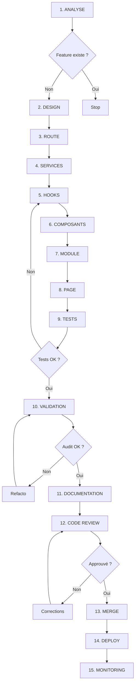

# 🎯 Workflow Senior - EmotionsCare

## Méthodologie de travail professionnelle

### 1️⃣ **Analyse & Planification (AVANT le code)**

#### A. Audit préalable obligatoire
```bash
# Avant toute feature, lancer les audits
npx tsx scripts/audit-routes-404.ts
npx tsx scripts/audit-pages-completeness.ts
npx tsx scripts/verify-all-routes-pages.ts
```

#### B. Checklist de conception
- [ ] La feature existe-t-elle déjà ? (éviter les doublons)
- [ ] Quelle route ? (vérifier `registry.ts`)
- [ ] Quels modules réutiliser ? (`src/modules/`)
- [ ] Quels composants UI existent ? (`src/components/`)
- [ ] Besoin de nouvelles tables Supabase ?
- [ ] Impact sur les RLS policies ?
- [ ] Tests e2e nécessaires ?

#### C. Design system first
```typescript
// ❌ MAUVAIS - Styles inline
<button className="bg-blue-500 text-white hover:bg-blue-600">

// ✅ BON - Design system
<Button variant="primary">
```

**Règle** : Jamais de couleurs directes. Toujours via `index.css` + `tailwind.config.ts`

---

### 2️⃣ **Implémentation (Structure claire)**

#### Structure type pour une nouvelle feature

```
📁 Feature "Coach Sessions"
│
├─ 1. Route (src/routerV2/registry.ts)
│   └─ Déclaration avec guards, segment, role
│
├─ 2. Page (src/pages/CoachSessionsPage.tsx)
│   ├─ Layout minimal
│   ├─ SEO (title, meta)
│   └─ Orchestration des modules
│
├─ 3. Module (src/modules/coach/sessions/)
│   ├─ CoachSessionsModule.tsx (composant principal)
│   ├─ hooks/
│   │   └─ useCoachSessions.ts (logique métier)
│   ├─ components/
│   │   ├─ SessionCard.tsx
│   │   ├─ SessionFilters.tsx
│   │   └─ SessionStats.tsx
│   └─ types.ts
│
├─ 4. Services (si nouveau)
│   └─ src/services/coachApi.ts
│
└─ 5. Tests
    ├─ src/modules/coach/sessions/__tests__/
    └─ src/e2e/coach-sessions.e2e.test.ts
```

#### Ordre d'implémentation
1. **Route** → Registry + alias
2. **Services** → API calls, Supabase queries
3. **Hooks** → Logique métier, états
4. **Composants** → UI pure, props typées
5. **Module** → Composition finale
6. **Page** → Wrapper avec layout
7. **Tests** → Unitaires + e2e

---

### 3️⃣ **Validation & Qualité (APRÈS le code)**

#### A. Tests automatiques
```bash
# Tests unitaires
npm run test

# Coverage min 90%
npm run test -- --coverage

# Tests e2e
npm run e2e
```

#### B. Validation architecture
```typescript
// Vérifier les imports circulaires
npx tsx scripts/check-circular-deps.ts

// Vérifier les routes
npx tsx scripts/verify-all-routes-pages.ts
```

#### C. Checklist PR
- [ ] `data-testid="page-root"` présent
- [ ] SEO : title + meta description
- [ ] Design system : 0 couleur en dur
- [ ] Tests : couverture ≥ 90%
- [ ] RLS policies : vérifiées
- [ ] Pas de `console.log`
- [ ] Pas de code commenté
- [ ] Types 100% (pas de `any`)
- [ ] Accessibilité : ARIA labels

---

### 4️⃣ **Refactoring Continu**

#### Indicateurs de dette technique
```typescript
// 🚨 ALERTE : Fichier > 300 lignes
// → Découper en modules

// 🚨 ALERTE : Fonction > 50 lignes
// → Extraire en helpers

// 🚨 ALERTE : Props > 10
// → Créer un type composite

// 🚨 ALERTE : Imports > 15
// → Problème d'architecture
```

#### Refactoring systématique
- **Chaque feature** → Opportunité de refacto
- **Règle du Boy Scout** : Laisser le code plus propre qu'on l'a trouvé
- **Documentation** : Mettre à jour `docs/` immédiatement

---

### 5️⃣ **Collaboration Équipe**

#### Git workflow
```bash
# Branches par feature
git checkout -b feat/coach-sessions

# Commits atomiques
git commit -m "feat(coach): add sessions listing"
git commit -m "test(coach): add sessions e2e tests"
git commit -m "docs(coach): update module registry"

# PR template
- 🎯 Objectif
- 🔧 Modifications
- ✅ Tests
- 📊 Impact
```

#### Code review checklist
- [ ] Architecture respectée (Route → Page → Module)
- [ ] Pas de régression (tests passent)
- [ ] Performance OK (< 3s loading)
- [ ] Accessibilité (axe-core 0 errors)
- [ ] Sécurité (RLS, CORS, sanitization)

---

### 6️⃣ **Outils de productivité**

#### Scripts npm personnalisés
```json
{
  "scripts": {
    "audit:all": "npm run audit:routes && npm run audit:pages",
    "audit:routes": "tsx scripts/audit-routes-404.ts",
    "audit:pages": "tsx scripts/audit-pages-completeness.ts",
    "validate:architecture": "tsx scripts/validate-architecture.ts",
    "db:check": "npm run supabase:check-rls && npm run supabase:check-types"
  }
}
```

#### VS Code extensions recommandées
- **ESLint** : Linting automatique
- **Prettier** : Formatage cohérent
- **Error Lens** : Erreurs inline
- **Import Cost** : Taille des imports
- **TypeScript Error Translator** : Erreurs lisibles

---

### 7️⃣ **Performance & Monitoring**

#### Métriques clés
- **LCP** (Largest Contentful Paint) < 2.5s
- **FID** (First Input Delay) < 100ms
- **CLS** (Cumulative Layout Shift) < 0.1
- **Bundle size** : < 500kb (gzipped)

#### Optimisations systématiques
```typescript
// Lazy loading des routes
const LazyCoachPage = lazy(() => import('./CoachSessionsPage'));

// Memoization
const SessionCard = memo(({ session }) => { ... });

// React Query pour cache
const { data } = useQuery(['sessions'], fetchSessions, {
  staleTime: 5 * 60 * 1000, // 5 minutes
});
```

---

### 8️⃣ **Documentation Vivante**

#### Mettre à jour systématiquement
- `docs/MODULES_LISTING.md` → Nouveau module
- `docs/PAGES_LISTING.md` → Nouvelle page
- `docs/ROUTING.md` → Nouvelle route
- `docs/module-registry.md` → État du module

#### Documentation inline
```typescript
/**
 * Hook pour gérer les sessions coach
 * 
 * @example
 * ```tsx
 * const { sessions, loading } = useCoachSessions();
 * ```
 * 
 * @returns {Object} sessions - Liste des sessions
 * @returns {boolean} loading - État de chargement
 */
export function useCoachSessions() { ... }
```

---

## 🎯 Résumé : Workflow en 8 étapes



---

## 💡 Principes Senior

### DRY (Don't Repeat Yourself)
✅ Extraire les patterns répétés en hooks/components  
✅ Créer des utilitaires partagés  
✅ Documenter les abstractions

### KISS (Keep It Simple, Stupid)
✅ Préférer la simplicité à la sophistication  
✅ Éviter l'over-engineering  
✅ Code lisible > Code clever

### YAGNI (You Aren't Gonna Need It)
✅ N'implémenter que ce qui est demandé  
✅ Pas de fonctionnalités "au cas où"  
✅ Itérer plutôt qu'anticiper

### SOLID
✅ Single Responsibility : 1 fonction = 1 job  
✅ Open/Closed : Extensible sans modification  
✅ Liskov Substitution : Types cohérents  
✅ Interface Segregation : Props minimales  
✅ Dependency Inversion : Abstractions > Implémentations

---

## 🚀 Objectifs Qualité

| Métrique | Cible | Outil |
|----------|-------|-------|
| **Test Coverage** | ≥ 90% | Vitest |
| **Type Safety** | 100% | TypeScript strict |
| **Bundle Size** | < 500kb | Rollup analyzer |
| **Lighthouse** | ≥ 90 | Chrome DevTools |
| **Accessibilité** | WCAG AA | axe-core |
| **Performance** | LCP < 2.5s | Web Vitals |

---

## 📋 Template PR

```markdown
## 🎯 Objectif
[Décrire la fonctionnalité]

## 🔧 Modifications
- [ ] Routes ajoutées : `/app/xxx`
- [ ] Modules créés : `src/modules/xxx`
- [ ] Services : `src/services/xxx`
- [ ] Tests : `src/e2e/xxx.e2e.test.ts`

## ✅ Tests
- [ ] Tests unitaires : ✅ 95% coverage
- [ ] Tests e2e : ✅ Parcours critique validé
- [ ] Test manuel : ✅ Sur staging

## 📊 Impact
- **Bundle** : +25kb (lazy load)
- **Performance** : LCP 1.8s
- **DB** : 2 nouvelles tables + RLS

## 📸 Screenshots
[Avant] | [Après]

## 🔗 Liens
- [Design Figma](#)
- [Ticket Jira](#)
- [Doc technique](docs/xxx.md)
```

---

**Objectif final** : Code maintenable, scalable, documenté, testé → Production-ready 🚀
