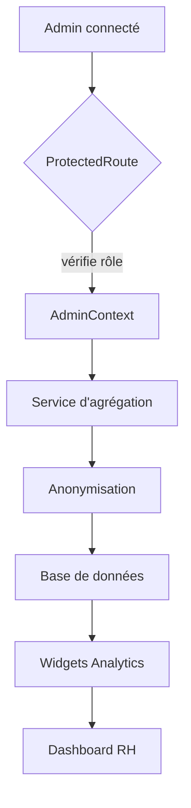

# Flow d'accès et d'agrégation du Dashboard RH

Ce schéma illustre la chaîne de traitement des données lorsqu'un administrateur accède au tableau de bord.

## Description

1. **Accès protégé** : la route `/b2b/admin/dashboard` est protégée par `ProtectedRoute` qui exige le rôle `b2b_admin`.
2. **Contextes et services** : `AdminContext` transmet les informations d'accès aux services d'agrégation.
3. **Anonymisation** : toute donnée nominative est supprimée avant stockage ou affichage.
4. **Reporting** : les widgets du dashboard consomment uniquement les données anonymisées provenant de la base.

La conformité RGPD impose qu'aucune statistique ne soit générée sur moins de cinq collaborateurs et qu'un log d'accès soit conservé pour chaque consultation du dashboard.
