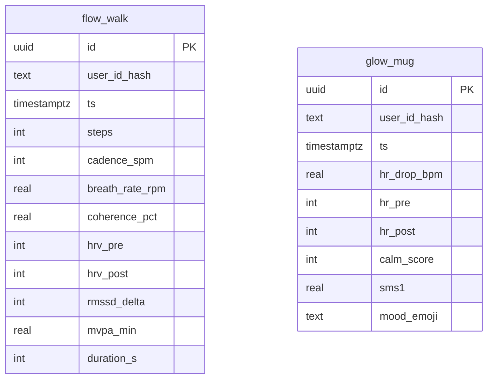

# Schéma des tables Breathwork

Ce document décrit les tables **flow_walk** et **glow_mug** destinées aux rituels Flow‑Field Walk et Glow‑Pulse Mug. Les indicateurs sont calculés via des triggers PL/pgSQL et l'accès est restreint par RLS sur `user_id_hash`.

Les fonctions `calc_flow_walk` et `calc_glow_mug` remplissent respectivement `coherence_pct`, `rmssd_delta`, `mvpa_min`, `hr_drop_bpm` et `sms1` avant insertion.
