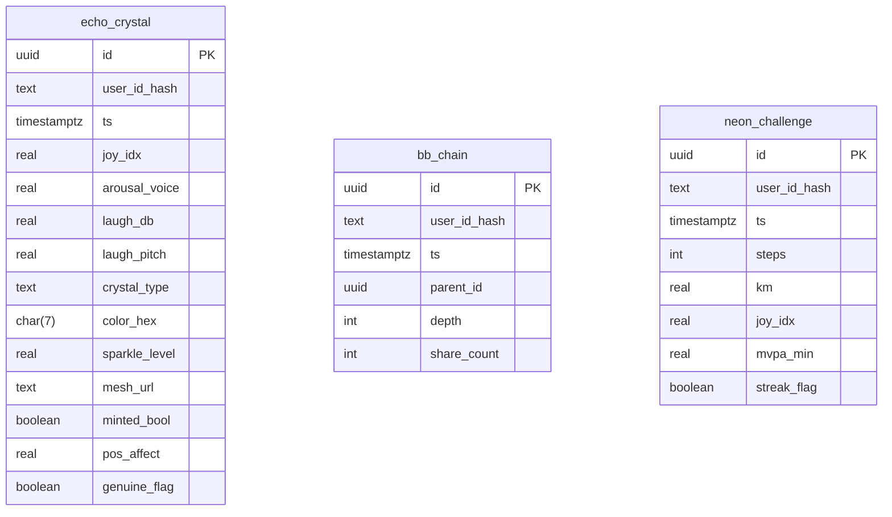

# Schéma des tables Gamification

Ce document décrit les tables **Echo-Crystal NFT**, **Bubble-Beat Chain Badge** et **Neon-Route Challenge** utilisées pour stocker les sessions brutes. Des triggers PL/pgSQL calculent immédiatement certains indicateurs.

Les politiques RLS restreignent l'accès via `user_id_hash`. Les fonctions `calc_echo_metrics`, `calc_bb_depth` et `calc_nc_metrics` pré-remplissent respectivement `pos_affect`, `genuine_flag`, `depth`, `mvpa_min` et `streak_flag` avant insertion.
