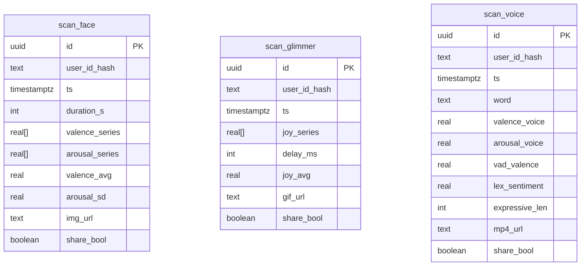

# Schéma des tables Scan XR

Ce document décrit les tables créées pour les widgets temps-réel **Aura-Ink Live**, **Mirror-Glimmer Filter** et **Whisper-Morph Gif**. Chaque ligne correspond à une session utilisateur et des triggers PL/pgSQL calculent immédiatement certains indicateurs.

Les politiques RLS restreignent l'accès à chaque utilisateur via `user_id_hash`. Les fonctions `calc_scan_face`, `calc_scan_glimmer` et `calc_scan_voice` mettent à jour les colonnes dérivées avant insertion.
