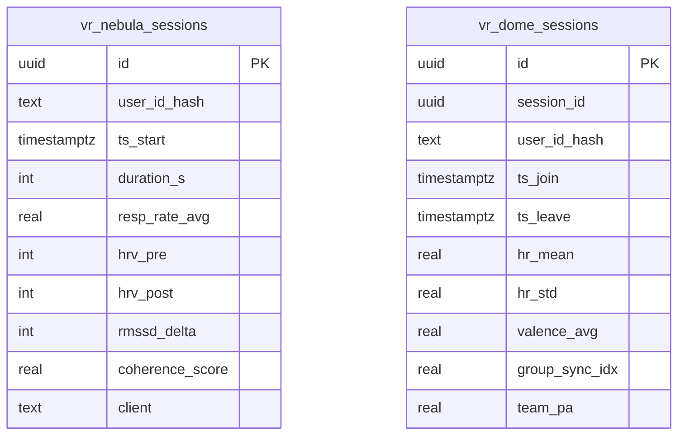

# Schéma des tables VR Raw

Ce document décrit les tables **vr_nebula_sessions** et **vr_dome_sessions** utilisées pour collecter les événements des espaces immersifs Bio‑Nebula et Glow‑Collective Dome. Les indicateurs scientifiques sont calculés via des triggers PL/pgSQL avant chaque insertion et les politiques RLS restreignent l'accès via `user_id_hash`.

- **rmssd_delta** : différence entre `hrv_post` et `hrv_pre`.
- **coherence_score** : 100 pts si la respiration moyenne est de 5–6 rpm, -10 pts par rpm d'écart.
- **group_sync_idx** : écart-type des `hr_mean` des participants au moment du départ.
- **team_pa** : valence moyenne du groupe lors du départ.
