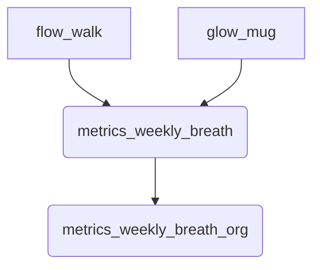
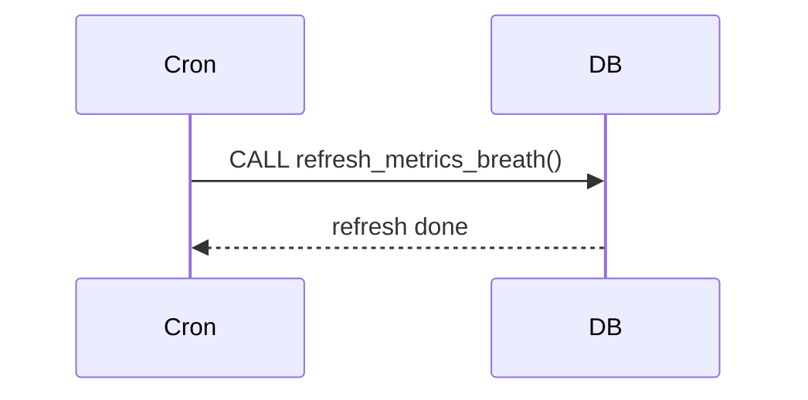

# ETL Breathwork

Ces vues matérialisées consolident les exercices **Flow‑Field Walk** et **Glow‑Pulse Mug** de manière hebdomadaire.

La fonction `refresh_metrics_breath()` est planifiée chaque nuit via **pg_cron**.
