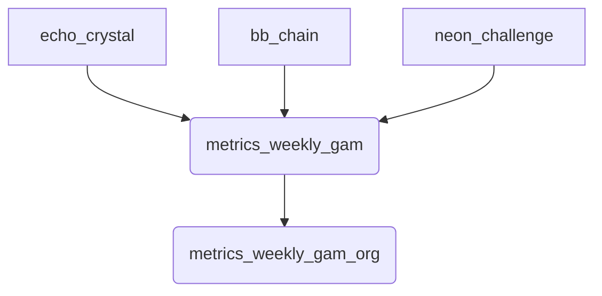

# ETL Gamification

Ces vues matérialisées agrègent les tables `echo_crystal`, `bb_chain` et `neon_challenge` de façon hebdomadaire.

La fonction `refresh_metrics_gam()` met à jour ces vues et est déclenchée chaque nuit via **pg_cron**.
