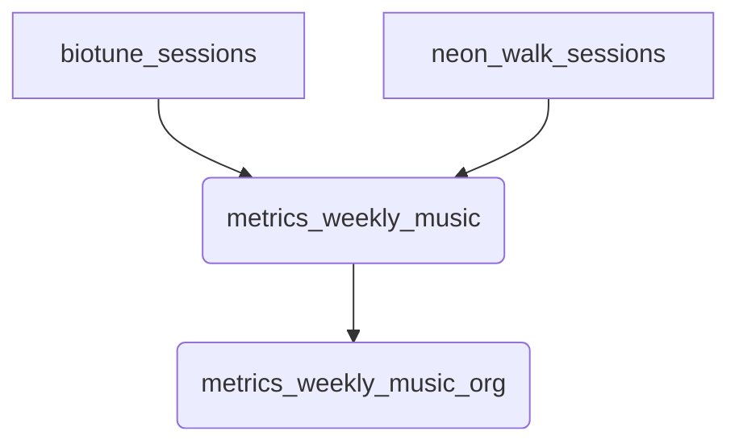

# ETL Musicothérapie

Ce module agrège les sessions **BioTune** et **Neon Walk** dans des vues matérialisées hebdomadaires.



## Exemples de requêtes

Rafraîchir manuellement les métriques :
```sql
CALL public.refresh_metrics_music();
```

Lister les scores d'une organisation :
```sql
SELECT *
FROM public.metrics_weekly_music_org
WHERE org_id = 'acme'
ORDER BY week_start DESC;
```
