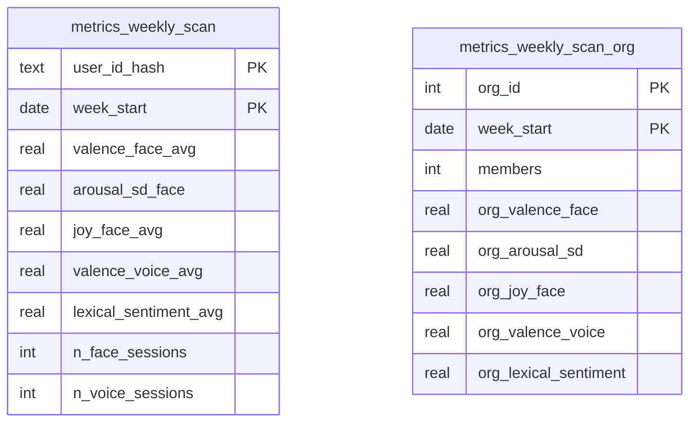

# Scan ETL Weekly Views

Ces vues agrègent les données issues des tables `scan_face`, `scan_glimmer` et `scan_voice` par semaine.
Elles alimentent les KPI de l’application B2C ainsi que les rapports RH côté B2B.

La fonction `refresh_metrics_scan()` réactualise ces vues et est planifiée chaque nuit via **pg_cron**.
