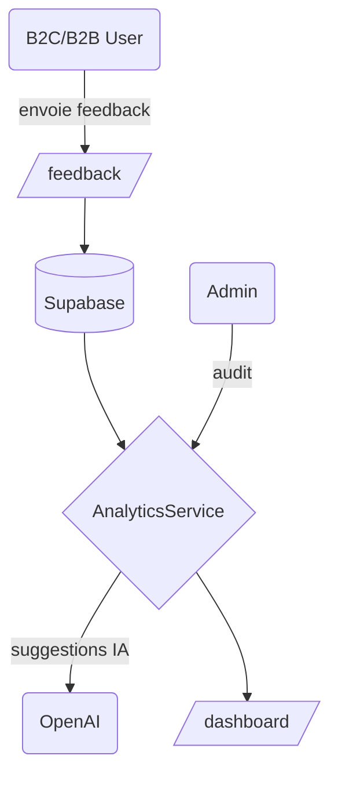

# Point 20 - Évaluation continue & amélioration proactive

Ce document synthétise l'état actuel de la plateforme **EmotionsCare** concernant la boucle de feedback utilisateur et les mécanismes d'amélioration continue. Il complète les audits précédents et trace les actions à mener pour un suivi métier optimal.

## 1. Utilisateurs concernés

- **B2C** : dépôt de feedback sur chaque module, historique de progression et suggestions personnalisées
- **B2B User** : évalue les formations internes, reçoit des bilans d'usage et des axes d'auto‑amélioration
- **B2B Admin** : accès aux dashboards analytiques, rapports d'audit et actions collectives

## 2. Chemins impliqués

- `/feedback` : point central pour enregistrer commentaires et évaluations
- `/b2c/dashboard` : vue personnelle avec historique et recommandations
- `/b2b/user/dashboard` : bilans individuels et notifications d'amélioration
- `/b2b/admin/dashboard` : rapports globaux, export CSV/PDF et lancement d'audits

## 3. APIs et modules observés

- **OpenAI** : utilisé pour la génération de synthèses et de recommandations (`src/services/openai`)
- **Supabase** : stockage des feedbacks et gestion des droits (`supabase/functions/*`)
- **Analytics utilitaire** : `src/utils/analytics.ts` collecte les événements mais ne centralise pas encore l'ensemble des KPIs
- **NotificationService** : structure proposée pour informer les utilisateurs (à formaliser)

## 4. Vérifications techniques

1. **Modèles de données**
   - `src/types` contient `analytics.ts`, `feedback` n'est pas encore défini de façon stricte
   - prévoir `FeedbackEntry`, `ImprovementSuggestion`, `AuditLog` avec versionnage
2. **Sécurité & RGPD**
   - `responsible-data-audit-point16.md` précise la nécessité d'un `AuditContext`
   - tout feedback doit être lié à un consentement et exportable/supprimable sur demande
3. **Modularité**
   - regrouper les services dans un dossier `src/services/feedback` pour accueillir la collecte multi-supports (texte, audio, anonyme)
4. **Reporting**
   - créer un microservice `AnalyticsService` pour agréger les feedbacks, calculer les scores et produire les exports
5. **Boucle d'amélioration IA**
   - pipeline : feedback → stockage Supabase → synthèse OpenAI → suggestion personnalisée → notification utilisateur
   - prévoir des tests unitaires sur chaque étape

## 5. Suggestions premium

- **Scoring d'amélioration** : calculer un indice long terme par utilisateur et par équipe
- **API Challenge** : permettre à l'admin de lancer des défis collectifs avec participation et scoring
- **Monitoring automatisé** : alerte lorsqu'un pourcentage de feedbacks reste sans traitement
- **Historique visuel** : données structurées pour export vers des dashboards externes
- **Smart notifications** : messages personnalisés en fonction des patterns détectés dans les audits

## 6. Checklist RGPD

- Consentement explicite avant toute collecte de feedback
- Possibilité d'opt‑out et de suppression complète (`DELETE /feedback/:id`)
- Journalisation horodatée des actions (`AuditLog` avec userId, module, impact)
- Anonymisation des données sensibles lors de l'export

## 7. Plan d'évolution

1. **Phase 1** : définir `FeedbackEntry` et créer le service de dépôt (`POST /feedback`)
2. **Phase 2** : mettre en place `AnalyticsService` avec calcul d'indicateurs et exports
3. **Phase 3** : intégrer la boucle d'amélioration IA et le système de notifications
4. **Phase 4** : ajouter les dashboards dédiés aux B2B Admins et la gestion des audits collectifs

---

Ce rapport constitue la base du **Point 20** pour instaurer une évaluation continue et une amélioration proactive sur EmotionsCare. Les modules proposés garantiront une montée en puissance progressive tout en respectant la conformité et la sécurité.
