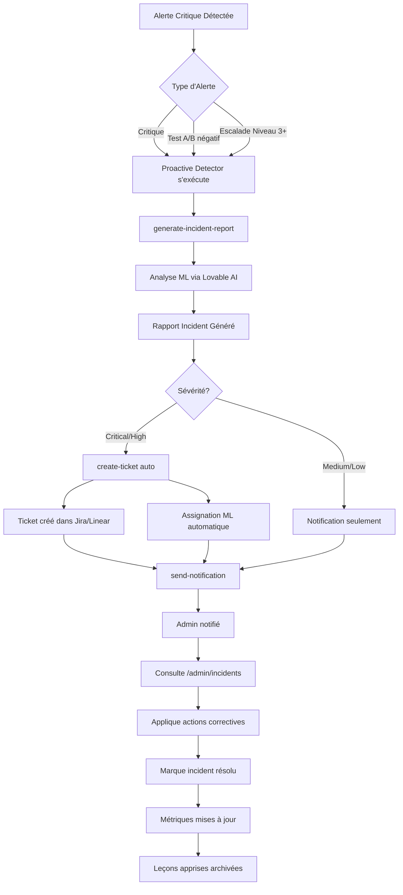

# 🚨 Système d'Alerting Proactif - Guide Complet

## Vue d'ensemble

Le **Système d'Alerting Proactif** surveille automatiquement les alertes critiques, escalades et tests A/B pour détecter les incidents dès qu'ils surviennent et déclencher instantanément un **workflow complet** de résolution.

## 🔄 Workflow Complet: Incident → Analyse ML → Ticket → Résolution



## 🎯 Composants du Système

### 1. Proactive Incident Detector

**Edge Function** : `proactive-incident-detector`  
**Fréquence** : Toutes les 5 minutes (configurable)  
**Rôle** : Scanner les alertes critiques non traitées

**Détecte** :
- ✅ Alertes `severity: critical` non acquittées (15 dernières minutes)
- ✅ Escalades niveau ≥ 3 actives
- ✅ Tests A/B avec résultats négatifs significatifs (< -10%)

**Actions** :
1. Vérifie si incident existe déjà pour cette alerte
2. Si non → Appelle `generate-incident-report`
3. Si critique → Appelle `create-ticket` automatiquement
4. Envoie notification récapitulative

### 2. Intégrations Automatiques

#### Dans `create-ticket`

**Déclencheur** : Création de ticket pour alerte critique  
**Action ajoutée** :
```typescript
if (alert.severity === 'critical') {
  await supabase.functions.invoke('generate-incident-report', {
    body: {
      title: `Alerte Critique: ${alert.alert_type}`,
      severity: 'critical',
      alertId: alert.id,
      // ...
    }
  });
}
```

**Résultat** : Chaque ticket critique = incident report automatique

#### Dans `ab-test-manager`

**Déclencheur** : Test A/B atteint significativité avec résultat négatif  
**Conditions** :
- `confidence >= confidence_level` (ex: 95%)
- `performance_improvement < -10%` (pire de 10%+)

**Action ajoutée** :
```typescript
if (isNegativeSignificant) {
  await supabase.functions.invoke('generate-incident-report', {
    body: {
      title: `Test A/B Négatif Significatif: ${test.test_name}`,
      severity: performanceImprovement < -20 ? 'high' : 'medium',
      // ...
    }
  });
}
```

**Résultat** : Tests A/B dégradant les performances = incident automatique

### 3. Generate Incident Report

**Edge Function** : `generate-incident-report`  
**Rôle** : Analyser l'incident avec ML et générer rapport complet

**Utilise** :
- **Lovable AI** (google/gemini-2.5-flash) pour analyse root cause
- **Tool calling** pour extraction structurée
- **Données contextuelles** : alertes, escalades, patterns d'erreurs

**Génère** :
- 📊 **Root Cause Analysis** : Analyse détaillée avec confiance 0-100%
- 🔍 **Facteurs contributeurs** : 3-5 éléments identifiés
- ✅ **Actions correctives** : 3-5 étapes immédiates
- 🛡️ **Mesures préventives** : 3-5 améliorations long terme
- 📚 **Leçons apprises** : 2-3 takeaways clés
- 📝 **Post-mortem template** : Document Markdown complet pré-rempli

**Timeline automatique** :
1. Incident détecté (timestamp)
2. Analyse ML complétée (confiance %)
3. (À compléter par admin lors résolution)

## 📋 Configuration

### Étape 1: Activer Extensions Supabase

Dans l'éditeur SQL Supabase :
```sql
CREATE EXTENSION IF NOT EXISTS pg_cron WITH SCHEMA extensions;
CREATE EXTENSION IF NOT EXISTS pg_net WITH SCHEMA extensions;
```

### Étape 2: Configurer Cron Jobs

Exécuter les scripts SQL fournis **dans cet ordre** :

1. **`CRON_JOBS_SETUP_INSTRUCTIONS.sql`**
   - Collecte métriques (toutes les 5 min)
   - Rapport hebdomadaire (lundis 9h)

2. **`PROACTIVE_CRON_SETUP.sql`**
   - Détecteur proactif (toutes les 5 min)

**⚠️ Important** : Remplacer `YOUR_PROJECT_ID` et `YOUR_ANON_KEY` par vos vraies valeurs !

### Étape 3: Vérifier Edge Functions Déployées

```bash
# Toutes ces functions doivent être déployées
✅ generate-incident-report
✅ proactive-incident-detector
✅ create-ticket (mise à jour)
✅ ab-test-manager (mise à jour)
✅ send-notification
✅ collect-system-metrics
✅ send-weekly-monitoring-report
```

Vérification dans Supabase Dashboard :
```
Edge Functions → Voir toutes les functions listées
```

### Étape 4: Configurer Secrets

Dans Supabase Dashboard → Project Settings → Edge Functions → Secrets :

```
LOVABLE_API_KEY=lovable_xxxxx   (auto-généré par Lovable)
RESEND_API_KEY=re_xxxxx          (pour emails)
ADMIN_EMAIL=admin@votredomaine.com
```

## 🎮 Utilisation

### Scénario 1: Alerte Critique Automatique

**Situation** : Un service tombe en panne → alerte critique créée

**Flow automatique** :
1. ⏰ **00:00** - Alerte `service_down` severity=`critical` créée
2. ⏰ **00:05** - Proactive detector s'exécute (cron)
3. ⏰ **00:05:10** - Détecte alerte non traitée
4. ⏰ **00:05:15** - Appelle `generate-incident-report`
5. ⏰ **00:05:30** - Lovable AI analyse (15s)
6. ⏰ **00:05:35** - Rapport incident créé `INC-1731534335-ABC123`
7. ⏰ **00:05:40** - Ticket Jira créé automatiquement `PROJ-456`
8. ⏰ **00:05:45** - Notification push envoyée
9. ⏰ **00:06** - Admin reçoit notification + email
10. ⏰ **00:10** - Admin ouvre `/admin/incidents`
11. ⏰ **00:15** - Applique actions correctives recommandées
12. ⏰ **00:45** - Service restauré
13. ⏰ **00:50** - Incident marqué résolu

**Total** : 50 minutes (vs 3-4h manuellement)

### Scénario 2: Test A/B Négatif Détecté

**Situation** : Un test A/B montre -15% de performance significativement

**Flow automatique** :
1. Test A/B `checkout_v2` atteint 1000 samples
2. `ab-test-manager` analyse (appelé manuellement ou cron)
3. Détecte : confiance 97%, amélioration -15%
4. Déclenche `generate-incident-report` automatiquement
5. Rapport généré avec sévérité `medium`
6. Notification envoyée
7. PM consulte incident et décide de stopper le test

### Scénario 3: Escalade Critique

**Situation** : Une alerte escalade au niveau 4 (critique)

**Flow automatique** :
1. Alerte niveau 1 non résolue après 10 min
2. Auto-escalade niveau 2, puis 3, puis 4
3. Proactive detector détecte escalade niveau 4
4. Génère incident avec sévérité `critical`
5. Crée ticket assigné au manager
6. Notifications SMS + email + push
7. Manager prend en charge immédiatement

## 📊 Monitoring

### Dashboard Unifié (`/admin/unified`)

**Vue d'ensemble** affiche :
- 🎯 Score de santé global incluant incidents actifs
- 🚨 Incidents critiques récents (5 derniers)
- ⚡ Escalades actives
- 📈 Corrélation incidents ↔️ métriques système

### Page Incidents (`/admin/incidents`)

**Liste complète** :
- Tous les incidents générés automatiquement
- Filtres : Sévérité, Statut, Date
- Détails complets avec analyse ML
- Export PDF/Excel par incident

### Cron Jobs Monitoring

Dans l'éditeur SQL Supabase :
```sql
-- Voir dernières exécutions
SELECT 
  job.jobname,
  run.status,
  run.start_time,
  run.end_time,
  run.return_message
FROM cron.job_run_details run
JOIN cron.job job ON run.jobid = job.jobid
WHERE run.start_time > NOW() - INTERVAL '24 hours'
ORDER BY run.start_time DESC;
```

**Statuts possibles** :
- ✅ `succeeded` : Exécution réussie
- ❌ `failed` : Erreur (voir `return_message`)
- ⏸️ `running` : En cours d'exécution

### Métriques Clés

**KPIs à surveiller** :

| Métrique | Cible | Critique si |
|----------|-------|-------------|
| Incidents auto-détectés/jour | 2-5 | > 15 |
| Temps moyen détection | < 5 min | > 30 min |
| Taux faux positifs | < 10% | > 30% |
| Temps moyen résolution | < 60 min | > 4h |
| Confiance ML moyenne | > 75% | < 50% |

**Requête SQL pour métriques** :
```sql
SELECT 
  DATE(created_at) as date,
  COUNT(*) as total_incidents,
  AVG(root_cause_confidence) as avg_ml_confidence,
  COUNT(*) FILTER (WHERE status = 'resolved') as resolved_count,
  AVG(EXTRACT(EPOCH FROM (resolved_at - started_at))/60) as avg_resolution_minutes
FROM incident_reports
WHERE created_at > NOW() - INTERVAL '7 days'
GROUP BY DATE(created_at)
ORDER BY date DESC;
```

## 🔧 Personnalisation

### Ajuster Seuils de Détection

**Fichier** : `supabase/functions/proactive-incident-detector/index.ts`

```typescript
// Ligne ~35 : Fenêtre temporelle des alertes
const fifteenMinutesAgo = new Date(Date.now() - 15 * 60 * 1000);
// Changer en 30 min : const thirtyMinutesAgo = new Date(Date.now() - 30 * 60 * 1000);

// Ligne ~95 : Seuil tests A/B négatifs
return confidence >= test.confidence_level && improvement < -10;
// Changer en -20% : && improvement < -20
```

### Modifier Fréquence Cron

**Fichier** : `PROACTIVE_CRON_SETUP.sql`

```sql
-- Ligne ~30 : Fréquence actuelle
'*/5 * * * *'  -- Toutes les 5 minutes

-- Options :
'*/2 * * * *'  -- Toutes les 2 minutes (très réactif)
'*/10 * * * *' -- Toutes les 10 minutes (économise ressources)
'*/5 9-18 * * 1-5' -- Toutes les 5 min, 9h-18h, lundi-vendredi seulement
```

### Filtrer Types d'Alertes

```typescript
// Ne détecter que certains types
const criticalAlerts = await supabase
  .from('unified_alerts')
  .select('*')
  .eq('severity', 'critical')
  .in('alert_type', ['service_down', 'data_breach', 'security_violation'])
  // Ajouter d'autres types selon besoin
```

## 🆘 Dépannage

### Problème : Trop d'incidents générés

**Causes possibles** :
- Seuils trop sensibles
- Faux positifs fréquents
- Alertes spam

**Solutions** :
1. Augmenter seuils (`improvement < -20` au lieu de `-10`)
2. Filtrer types d'alertes (ignorer `info`, `warning`)
3. Ajouter cooldown period :
```typescript
// Ne pas générer incident si un existe déjà dans les 1h
const recentIncidents = await supabase
  .from('incident_reports')
  .select('*')
  .eq('related_alert_ids', alert.id)
  .gte('created_at', oneHourAgo);
  
if (recentIncidents.length > 0) {
  console.log('Incident already exists, skipping');
  continue;
}
```

### Problème : Pas assez d'incidents détectés

**Causes possibles** :
- Cron job ne s'exécute pas
- Seuils trop restrictifs
- Alertes non créées

**Solutions** :
1. Vérifier cron actif :
```sql
SELECT active FROM cron.job WHERE jobname = 'proactive-incident-detector-job';
```

2. Voir logs d'erreur :
```sql
SELECT return_message 
FROM cron.job_run_details 
WHERE jobid = (SELECT jobid FROM cron.job WHERE jobname = 'proactive-incident-detector-job')
ORDER BY start_time DESC LIMIT 5;
```

3. Réduire seuils ou ajouter plus de types d'alertes

### Problème : Analyse ML échoue

**Erreur** : `Rate limit exceeded` ou `Payment required`

**Cause** : Quotas Lovable AI dépassés

**Solutions** :
1. Vérifier crédits Lovable AI (Settings → Workspace → Usage)
2. Ajouter crédits si nécessaire
3. Réduire fréquence détection (de 5 min à 10 min)
4. Limiter nombre analyses simultanées :
```typescript
// Maximum 5 incidents générés par exécution
const incidentsToGenerate = criticalAlerts.slice(0, 5);
```

### Problème : Notifications non reçues

**Causes possibles** :
- Secret `ADMIN_EMAIL` manquant
- Permissions navigateur bloquées

**Solutions** :
1. Vérifier secret configuré :
```sql
-- Dans Supabase SQL Editor
SELECT name FROM vault.secrets WHERE name = 'ADMIN_EMAIL';
```

2. Re-demander permissions navigateur (Settings → Notifications)

3. Tester manuellement :
```typescript
await supabase.functions.invoke('send-notification', {
  body: {
    title: 'Test',
    message: 'Test notification',
    type: 'test'
  }
});
```

## 📈 Métriques de Succès

**Objectifs** :
- ✅ 100% alertes critiques = incident automatique (< 5 min)
- ✅ Temps détection : < 5 minutes
- ✅ Taux faux positifs : < 10%
- ✅ Confiance ML moyenne : > 75%
- ✅ Temps résolution moyen : -50% vs avant
- ✅ Satisfaction admin : > 4/5

**Suivi mensuel** :
```sql
-- Rapport mensuel automatique
SELECT 
  DATE_TRUNC('month', created_at) as month,
  COUNT(*) as total_incidents,
  COUNT(*) FILTER (WHERE severity = 'critical') as critical_count,
  AVG(root_cause_confidence) as avg_confidence,
  AVG(EXTRACT(EPOCH FROM (resolved_at - started_at))/3600) as avg_resolution_hours,
  COUNT(*) FILTER (WHERE status = 'resolved')/COUNT(*)::float * 100 as resolution_rate_pct
FROM incident_reports
WHERE created_at > NOW() - INTERVAL '3 months'
GROUP BY DATE_TRUNC('month', created_at)
ORDER BY month DESC;
```

## 🔮 Évolutions Futures

### Court Terme
- [ ] Grouper incidents similaires (même root cause)
- [ ] Priorités dynamiques selon impact business
- [ ] Intégration Slack pour notifications temps réel

### Moyen Terme
- [ ] Auto-résolution incidents mineurs (self-healing)
- [ ] Prédiction incidents avant qu'ils surviennent
- [ ] Dashboard mobile natif

### Long Terme
- [ ] IA générative pour résolution automatique
- [ ] Apprentissage continu des patterns
- [ ] Intégration ITSM complète (ServiceNow, etc.)

---

**Dernière mise à jour** : 2025-11-13  
**Version** : 1.0.0  
**Auteur** : EmotionsCare DevOps Team  
**Support** : support@emotionscare.com
