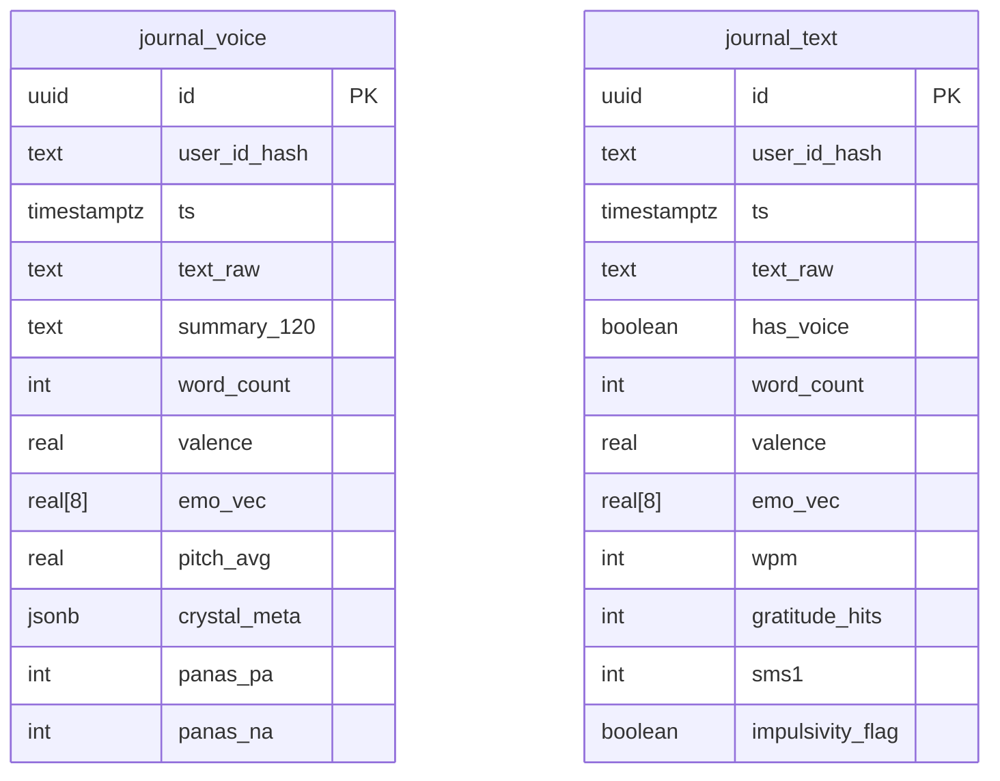

# Journal Widgets Schema

```mermaid
erDiagram
    journal_voice {
        uuid id PK
        text user_id_hash
        timestamptz ts
        text text_raw
        text summary_120
        int word_count
        real valence
        real[8] emo_vec
        real pitch_avg
        jsonb crystal_meta
        int panas_pa
        int panas_na
    }
    journal_text {
        uuid id PK
        text user_id_hash
        timestamptz ts
        text text_raw
        boolean has_voice
        int word_count
        real valence
        real[8] emo_vec
        int wpm
        int gratitude_hits
        int sms1
        boolean impulsivity_flag
    }
```
