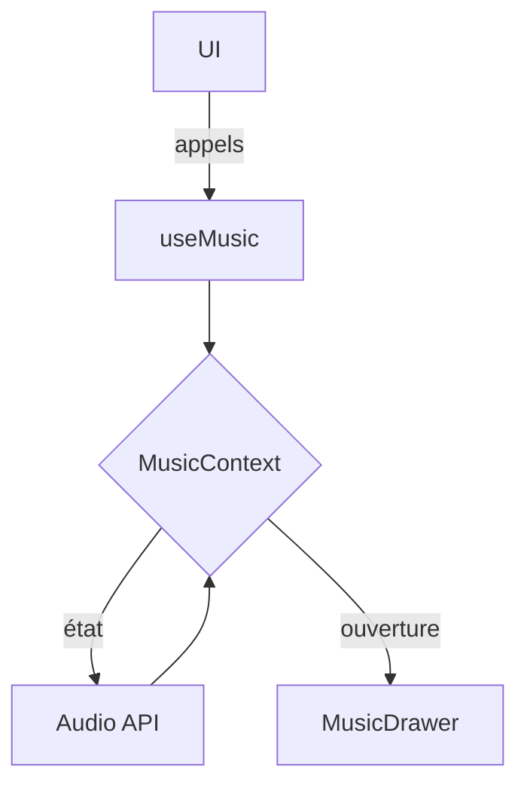

# Audit technique du module musique (2025)

Ce rapport résume l'état actuel du module **Music** dans `src/` et propose des axes d'amélioration.

## 1. Contexte et provider

- `MusicContext` est défini dans `src/contexts/MusicContext.tsx` et exposé via `useMusic`.
- Un fichier `src/contexts/music/index.ts` réexporte `MusicProvider` et `useMusic` pour simplifier l'import.
- L'état géré par le provider inclut `currentTrack`, `currentPlaylist`, `playlists`, les informations de lecture et les méthodes de contrôle (lecture, pause, navigation…).
- Les playlists sont initialisées via `mockPlaylists` et `emotionPlaylists` lors du montage du provider.
- Le provider persiste l'élément audio en interne et expose `loadPlaylistForEmotion` ainsi que `getRecommendationByEmotion`.



## 2. Hooks et composants

- Le hook principal `src/hooks/useMusic.ts` permet d'accéder au contexte.
- Des hooks spécialisés existent dans `src/hooks/music/` (ex. `useMusicRecommendation`).
- Deux composants `MusicDrawer` sont présents :
  - `src/components/music/MusicDrawer.tsx`
  - `src/components/music/player/MusicDrawer.tsx`
  Ces implémentations se recouvrent partiellement.
- Les pages `/music`, `/music/create` et `/music/preferences` (dossiers `src/pages/b2c` et `src/pages/b2b/*`) consomment tous `MusicProvider` via l'enveloppe `DashboardPage`.

## 3. Typage

- Les types musicaux sont définis dans `src/types/music.ts`.
- Un fichier `src/types/music.d.ts` existe encore mais contient des doublons. Il serait préférable de ne conserver qu'un seul fichier TypeScript (`music.ts`) et de réexporter via `src/types/music/index.ts`.
- Les principaux types sont `MusicTrack`, `MusicPlaylist`, `MusicContextType`, `EmotionMusicParams`.

## 4. Points forts

- Contexte unique utilisé globalement via `MusicProvider`.
- Hook `useMusic` centralisé et réexporté.
- Utilitaires de compatibilité (`musicCompatibility.ts`, `musicCompatibilityUtils.ts`) pour normaliser les données.

## 5. Points d'amélioration

- **Fusionner les deux `MusicDrawer`** pour éviter la duplication et faciliter la maintenance.
- **Découper le contexte en slices** (player, playlists, préférences, historique, favoris) pour préparer l'évolution vers des fonctionnalités premium.
- **Unifier le typage** en supprimant `music.d.ts` et en complétant `music.ts` (ex. `PlaylistType`).
- **Prévoir un système d'adapters** pour intégrer des API externes (Spotify, Apple Music…).
- **Persistance** : l'historique et les préférences pourraient être stockés via Supabase ou `localStorage`.
- **Sécurité / accès** : vérifier que chaque utilisateur ne peut accéder qu'à ses playlists et historiques.
- **Tests** : ajouter des tests unitaires autour des fonctions du contexte (`playTrack`, `loadPlaylistForEmotion`, `toggleMute`…).

## 6. Propositions d'évolution

1. Structurer `MusicContext` par modules (player, playlist, preferences, history) pour isoler la logique et améliorer la lisibilité.
2. Introduire un type discriminant pour les playlists :
   ```ts
   export type PlaylistType = 'user' | 'ai' | 'suggestion' | 'history';
   ```
3. Implémenter une couche d'adapter afin de connecter Spotify ou d'autres fournisseurs de musique.
4. Préparer la synchronisation en temps réel (WebSocket) pour un mode collaboratif.
5. Compléter la documentation et automatiser la validation via tests (`vitest`) et `tsc`.

