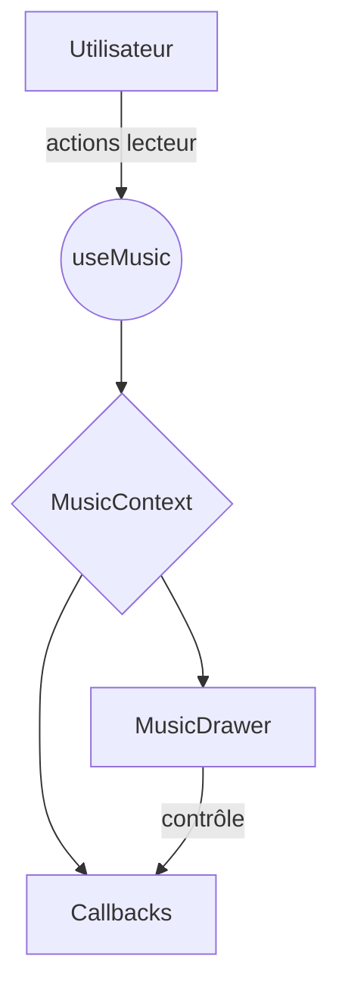

# Audit technique du module musique et plan de fonctionnalités premium

Ce document complète `docs/music-module-audit.md` avec une analyse détaillée du module **Music** et du composant **MusicDrawer**. Il intègre l'existant, les optimisations structurelles recommandées et la cartographie des 10 fonctionnalités premium axées sur le bien‑être.

## 1. État actuel
- Deux `MusicContext` distincts sont présents (`src/contexts/MusicContext.tsx` et `src/contexts/music.tsx`).
- Deux `MusicDrawer` coexistent dans `src/components/music/MusicDrawer.tsx` et `src/components/music/player/MusicDrawer.tsx`.
- Les types sont éparpillés entre `src/types/music.ts` et `src/types/music.d.ts`.
- Peu de tests couvrent la logique du player.

## 2. Optimisations structurelles recommandées
1. **Contexte unique** : conserver `src/contexts/MusicContext.tsx` comme source unique et supprimer les doublons.
2. **Hook partagé** : exposer `useMusic` dans `src/hooks/useMusic.ts` afin de mutualiser l'accès au contexte.
3. **MusicDrawer unique** : fusionner les deux implémentations en un seul composant modulable.
4. **Typage centralisé** : rassembler toutes les interfaces dans `src/types/music.ts` et utiliser `export *` depuis `music.d.ts` pour la compatibilité externe.
5. **Tests** : ajouter des tests unitaires sur la navigation, le volume et la génération de playlists.

## 3. Fonctionnalités premium “bien‑être / humeur”
La plateforme peut exploiter l'API **TopMediai** pour offrir dix fonctionnalités à forte valeur ajoutée :

1. **Coach musical IA contextuel** : analyse de l'humeur et suggestion automatique d'ambiance.
2. **Playlists émotionnelles intelligentes** : génération de playlists sur mesure selon un objectif (durée, style, export MIDI/MP3).
3. **Création collaborative de musique d’équipe** : co‑création d’ambiances via prompts partagés.
4. **Rituels d’onboarding ou d’événement** : ambiance sonore personnalisée pour chaque étape clé.
5. **Météo sonore automatique** : proposition quotidienne d’ambiance en fonction de la météo émotionnelle de l’équipe.
6. **Personnalisation avancée** : réglage du tempo, de la tonalité et de l’intensité avec pré‑écoute en direct.
7. **Export “partition bien‑être”** : export MIDI ou partition pour les ateliers créatifs.
8. **API “musique émotionnelle”** : endpoints permettant aux outils partenaires d’appeler la génération musicale.
9. **Packs thématiques événements/saisons** : prompts pré‑définis pour Noël, Halloween, rentrée, etc.
10. **Bibliothèque partagée et remix** : partage volontaire des meilleures créations et remix collaboratifs.

Chaque fonctionnalité doit être développée sous forme de hook ou de service indépendant pour rester "plug & play". L’authentification, les rôles et la RGPD doivent être respectés.

## 4. Propositions d’implémentation
- **Context Provider unique** gérant la file d’attente, la génération via API et la persistance sécurisée.
- **Services** dédiés dans `src/services/music/` pour l’appel à TopMediai (génération, export, collaboration).
- **Typage** enrichi : `MusicPreferences`, `MusicSession`, `TeamMood`.
- **Tests** : scénarios unitaires autour de la sélection automatique des playlists et de la collaboration.
- **Endpoints** externes décrits dans `docs/API_INTEGRATION.md` (à compléter).

## 5. Points de vigilance
- Gestion des limites d’usage et de la latence de l’API TopMediai.
- Sécurisation des fichiers exportés (stockage chiffré via Supabase ou équivalent).
- Mise à l’échelle pour supporter plusieurs générations simultanées.

---
Ce plan sert de référence pour transformer le module musique en moteur d’innovation émotionnelle. Les étapes de développement doivent être validées avec le product owner avant toute modification majeure.
