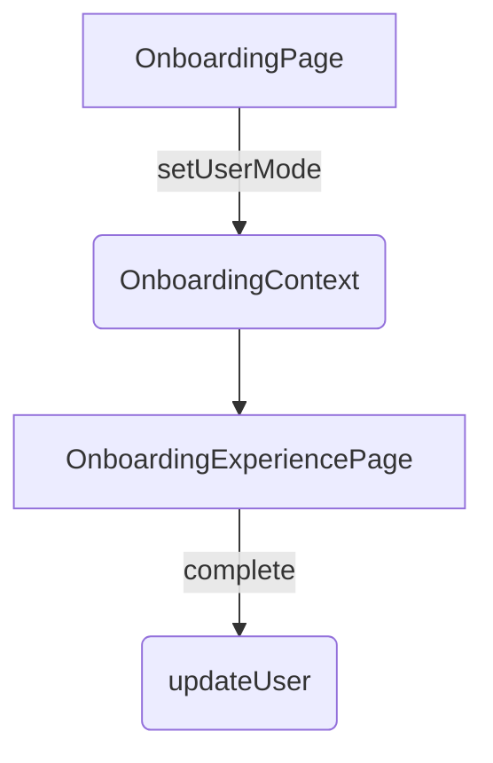

# Point 14 - Audit Onboarding et Formation immersive

Ce rapport fait le bilan de la logique d'onboarding actuelle d'EmotionsCare et propose des améliorations pour une expérience de formation plus complète et traçable.

## 1. Contexte existant

- `OnboardingContext` centralise l'état de progression et expose les actions de navigation (`nextStep`, `previousStep`, `goToStep`). Il est défini dans `src/contexts/OnboardingContext.tsx`.
- Les étapes par défaut sont stockées dans `src/data/onboardingSteps.ts` et typées via l'interface `OnboardingStep` (`src/types/onboarding.ts`).
- `AppProviders` injecte globalement `OnboardingProvider` avec les étapes par défaut.
- Les pages dédiées à l'onboarding sont :
  - `/onboarding` (`OnboardingPage`) pour la saisie initiale et la sélection du mode.
  - `/onboarding-experience` (`OnboardingExperiencePage`) qui consomme `OnboardingContext` et affiche les étapes.
  - `/b2c/onboarding` (`B2COnboardingPage`) qui reprend des étapes spécifiques au parcours particulier.

## 2. Observations techniques

- La progression n'est pas persistée : `OnboardingContext` utilise uniquement `useState` sans sauvegarde locale ou distante.
- Aucune logique de traçage détaillé (temps passé, succès/échec par étape) n'est implémentée.
- Les rôles B2B et Admin ne disposent pas de parcours différencié, seule la variante B2C est fournie.
- Aucun `TrainingContext` ou module de formation n'est présent. Les composants actuels se limitent à l'onboarding basique.
- Les tests unitaires couvrent principalement le routage et certains contextes, mais pas la complétion de l'onboarding.

## 3. Schéma simplifié du contexte actuel

## 4. Recommandations d'amélioration

1. **Persistance et synchronisation**
   - Sauvegarder la progression (`currentStep`, `userResponses`) dans `localStorage` et/ou Supabase pour permettre la reprise multi‑appareil.
   - Exposer un service `onboardingService` responsable des lectures/écritures.

2. **Typage enrichi**
   - Étendre `OnboardingStep` avec un champ `role: 'b2c' | 'b2b_user' | 'b2b_admin'` afin de charger dynamiquement les étapes selon le contexte utilisateur.
   - Créer un fichier `src/types/training.ts` pour préparer les modules de formation (quiz, vidéos, scores...).

3. **Hooks dédiés**
   - Factoriser `useOnboarding` avec des helpers `startOnboarding`, `completeStep`, `addFeedback`, `getProgress` afin de mieux tester chaque fonction.
   - Prévoir un `useTraining` lorsqu'un module de formation sera ajouté.

4. **Tracking et analytics**
   - Enregistrer l'heure de début/fin de chaque étape et les interactions utilisateur afin de générer des rapports accessibles à l'admin.
   - Préparer une table Supabase `onboarding_logs` pour centraliser ces données.

5. **Parcours différenciés**
   - Définir des étapes spécifiques pour les rôles B2B et Admin dans `onboardingSteps.ts`.
   - Charger ces étapes dans `AppProviders` selon `userMode` pour personnaliser l'expérience.

6. **Extensibilité formation**
   - Concevoir un `TrainingContext` pouvant accueillir des modules externes (quiz, webinaires, IA...).
   - Documenter une API REST / RPC pour récupérer la liste des formations disponibles et reporter la progression (scores, feedbacks).

7. **Tests automatisés**
   - Ajouter des tests sur la navigation des étapes et la sauvegarde finale.
   - Vérifier la reprise de session après rafraîchissement ou changement d'appareil.

## 5. Feuille de route conseillée

- [ ] Implémenter la persistance locale (localStorage) puis distante (Supabase).
- [ ] Étendre les types `OnboardingStep` et créer `TrainingContext` avec les interfaces associées.
- [ ] Mettre à jour la documentation et fournir un guide d'extension pour l'ajout de nouveaux modules de formation.
- [ ] Ajouter des tests Vitest couvrant l'ensemble du parcours.

---

Ce point d'audit fournit les bases pour un onboarding et une formation plus immersifs, modulaires et traçables. Les améliorations proposées faciliteront l'intégration de contenus pédagogiques avancés et d'analyses IA futures.
