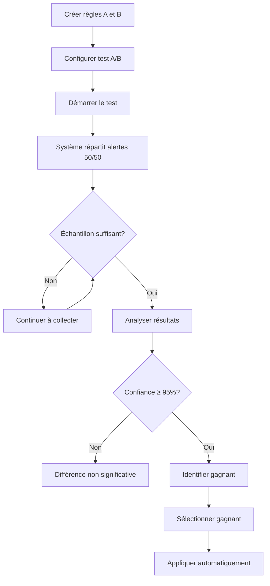

# 📚 Guide de configuration - Monitoring Avancé EmotionsCare

Ce guide explique comment configurer et utiliser les fonctionnalités avancées de monitoring : chatbot IA, intégrations de tickets automatiques (Jira/Linear), et tests A/B pour optimiser les règles d'escalade.

---

## 🤖 Chatbot IA de Monitoring

### Présentation

Le chatbot IA permet d'interroger vos données de monitoring en langage naturel et d'obtenir des insights personnalisés sur les patterns d'erreurs, les escalades actives, et les prédictions ML.

### Accès

**URL** : `/admin/escalation/monitoring` → Onglet "Assistant IA"

**Rôle requis** : Admin

### Fonctionnalités

- **Questions en langage naturel** : "Quelles sont les alertes critiques en cours ?"
- **Analyse contextuelle** : Le chatbot a accès aux données en temps réel (escalades, patterns d'erreurs, prédictions ML, métriques de performance)
- **Insights actionnables** : Suggestions basées sur l'analyse IA des tendances

### Exemples de questions

```
- "Quels sont les patterns d'erreurs récurrents cette semaine ?"
- "Quelles alertes ont été escaladées plus de 3 fois ?"
- "Quelles sont les prédictions ML pour les prochaines 24h ?"
- "Comment évoluent les performances d'escalade ce mois-ci ?"
- "Y a-t-il des anomalies dans les patterns d'erreurs ?"
```

### Configuration technique

**Edge function** : `monitoring-chatbot`
- **Modèle IA** : Google Gemini 2.5 Flash (via Lovable AI)
- **Rate limit** : Géré automatiquement (429/402 errors si dépassement)
- **Authentification** : JWT token requis

### Gestion des limites

Si vous recevez des erreurs :
- **429** : Trop de requêtes, attendez quelques instants
- **402** : Crédits Lovable AI insuffisants → Rechargez votre compte

---

## 🎫 Intégrations Tickets Automatiques

### Présentation

Créez automatiquement des tickets Jira ou Linear depuis les alertes escaladées, avec assignation intelligente basée sur les patterns ML détectés.

### Accès

**URL** : `/admin/tickets/integrations`

**Rôle requis** : Admin

---

## 📋 Configuration Jira

### Étape 1 : Obtenir les identifiants Jira

1. **Connectez-vous à Jira** (votre instance Atlassian)
2. **Créez un API Token** :
   - Allez dans **Account Settings** → **Security** → **API Tokens**
   - Cliquez sur **Create API token**
   - Donnez-lui un nom (ex: "EmotionsCare Monitoring")
   - **Copiez le token** (vous ne pourrez plus le voir après)

3. **Notez vos identifiants** :
   - **URL API** : `https://your-domain.atlassian.net`
   - **API Token** : Le token créé ci-dessus
   - **Project Key** : La clé de votre projet (ex: "TECH", "OPS")

### Étape 2 : Configurer dans EmotionsCare

1. Allez sur `/admin/tickets/integrations`
2. Cliquez sur **"Nouvelle intégration"**
3. Remplissez le formulaire :
   - **Type** : Jira
   - **Nom** : Un nom descriptif (ex: "Jira Production")
   - **URL API** : `https://your-domain.atlassian.net`
   - **API Token** : Collez votre token
   - **Clé Projet** : Votre project key (ex: "TECH")
   - **Assignee par défaut** : Nom d'utilisateur Jira (optionnel)
4. **Activez l'intégration** (switch)
5. Cliquez sur **"Créer"**

### Format des tickets Jira créés

```
Titre : [CRITICAL] auth_failure: Failed to authenticate user

Description :
Alerte escaladée automatiquement

*Détails:*
- Type: auth_failure
- Sévérité: critical
- Niveau d'escalade: 2
- Message: Failed to authenticate user with token
- Timestamp: 2025-11-13T19:45:00Z

*Analyse ML:*
Assignee suggéré: john.doe (confiance: 87%)

*Patterns détectés:*
15 occurrences similaires trouvées
```

---

## 🎯 Configuration Linear

### Étape 1 : Obtenir les identifiants Linear

1. **Connectez-vous à Linear** (app.linear.app)
2. **Créez un API Key** :
   - Allez dans **Settings** → **API**
   - Cliquez sur **Create new API key**
   - Donnez-lui un nom (ex: "EmotionsCare Monitoring")
   - **Copiez la clé** (vous ne pourrez plus la voir après)

3. **Récupérez votre Team ID** :
   - Dans Linear, ouvrez les Developer Tools (F12)
   - Dans l'onglet **Network**, créez une issue test
   - Cherchez la requête GraphQL et notez le `teamId` dans le payload

### Étape 2 : Configurer dans EmotionsCare

1. Allez sur `/admin/tickets/integrations`
2. Cliquez sur **"Nouvelle intégration"**
3. Remplissez le formulaire :
   - **Type** : Linear
   - **Nom** : Un nom descriptif (ex: "Linear Engineering")
   - **URL API** : `https://api.linear.app/graphql` (défaut)
   - **API Token** : Collez votre API key
   - **Clé Projet** : Votre Team ID (ex: "abc12345-...")
   - **Assignee par défaut** : User ID Linear (optionnel)
4. **Activez l'intégration** (switch)
5. Cliquez sur **"Créer"**

---

## 🤖 Assignation Intelligente ML

### Comment ça marche

Quand un ticket est créé automatiquement :

1. **Analyse des patterns** : Le système récupère les 10 dernières occurrences similaires
2. **Prédiction ML** : L'IA analyse qui a résolu des erreurs similaires
3. **Score de confiance** : Calcule une confiance (0-100%)
4. **Assignation** : 
   - Si confiance > 70% → Assigne automatiquement à la personne suggérée
   - Sinon → Utilise l'assignee par défaut de l'intégration

### Exemple de suggestion ML

```json
{
  "ml_suggested_assignee": "alice.smith",
  "ml_confidence": 0.92,
  "reasoning": "Alice a résolu 8 erreurs similaires d'authentification 
                avec un taux de succès de 100% en moyenne 2.5h"
}
```

---

## 🧪 Tests A/B des Règles d'Escalade

### Présentation

Comparez différentes configurations de règles d'escalade en parallèle et laissez le système choisir automatiquement la plus performante.

### Accès

**URL** : `/admin/escalation/ab-tests`

**Rôle requis** : Admin

---

## 📊 Créer un Test A/B

### Étape 1 : Préparer les règles à comparer

1. Allez sur `/admin/escalation/config`
2. Créez deux règles d'escalade différentes :
   - **Règle A (Contrôle)** : Ex: Escalade après 30min, max 3 niveaux
   - **Règle B (Variant)** : Ex: Escalade après 15min, max 4 niveaux

### Étape 2 : Configurer le test

1. Allez sur `/admin/escalation/ab-tests`
2. Cliquez sur **"Nouveau test A/B"**
3. Remplissez le formulaire :

```
Nom du test : "Escalade rapide vs progressive"
Description : "Tester si une escalade plus rapide améliore le temps de résolution"
Règle contrôle (A) : [Sélectionnez la règle A]
Règle variant (B) : [Sélectionnez la règle B]
Échantillon min. : 100 (nombre d'alertes minimum pour analyse)
Confiance : 0.95 (95% de significativité statistique)
```

4. Cliquez sur **"Créer"**

### Étape 3 : Démarrer le test

1. Le test est créé en statut **"Brouillon"**
2. Cliquez sur **"Démarrer"** quand vous êtes prêt
3. Le système répartit automatiquement les alertes entre A et B (50/50)

---

## 📈 Suivre un Test A/B

### Métriques suivies

- **Total d'alertes** : Nombre d'alertes testées pour chaque variant
- **Taux de résolution** : % d'alertes résolues
- **Temps moyen de résolution** : En heures
- **Nombre d'escalades moyennes** : Nombre de fois qu'une alerte est escaladée

### Progression

Une barre de progression indique le nombre d'alertes collectées par rapport à l'échantillon minimum requis.

```
Échantillon collecté : 75 / 100
███████████████░░░░░ 75%
```

### Analyse en temps réel

Cliquez sur **"Analyser"** pour obtenir les résultats actuels :

```
Métriques Contrôle (A) :
- Total : 38 alertes
- Taux résolution : 84.2%
- Temps moy. résolution : 3.2h
- Escalades moyennes : 1.8

Métriques Variant (B) :
- Total : 37 alertes
- Taux résolution : 91.9%
- Temps moy. résolution : 2.1h
- Escalades moyennes : 2.3

Confiance statistique : 78.5% (seuil: 95%)
→ Échantillon insuffisant, continuer le test
```

---

## 🏆 Sélectionner le Gagnant

### Critères de sélection

Le système calcule un **score combiné** pour chaque variant :

```
Score = (Taux résolution × 100) - (Temps résolution / 60)
```

- Plus le score est élevé, mieux c'est
- Un bon variant résout plus d'alertes, plus rapidement

### Sélection automatique

Quand :
1. ✅ Échantillon minimum atteint
2. ✅ Confiance statistique ≥ seuil configuré (ex: 95%)

Le bouton **"Sélectionner gagnant"** devient actif.

### Effet de la sélection

Quand vous cliquez sur **"Sélectionner gagnant"** :

1. ✅ Le test passe en statut **"Terminé"**
2. ✅ La règle gagnante est **activée automatiquement**
3. ✅ La règle perdante est **désactivée automatiquement**
4. 📊 Les métriques finales sont enregistrées

---

## 🔄 Workflow Complet d'un Test A/B



---

## ⚙️ Configuration Cron Jobs (Optionnel)

Pour une automatisation complète, configurez les cron jobs Supabase.

### Analyser les tests A/B automatiquement

```sql
-- Analyse tous les tests en cours toutes les heures
select cron.schedule(
  'analyze-ab-tests',
  '0 * * * *', -- Toutes les heures
  $$
  select
    net.http_post(
        url:='https://yaincoxihiqdksxgrsrk.supabase.co/functions/v1/ab-test-manager',
        headers:='{"Content-Type": "application/json", "Authorization": "Bearer YOUR_ANON_KEY"}'::jsonb,
        body:='{"action": "analyze_all"}'::jsonb
    ) as request_id;
  $$
);
```

---

## 🎯 Bonnes Pratiques

### Tests A/B

1. **Testez une seule variable à la fois** (délai OU niveaux, pas les deux)
2. **Attendez l'échantillon minimum** avant de conclure
3. **Ne modifiez pas les règles pendant le test**
4. **Documentez vos hypothèses** dans la description du test

### Intégrations Tickets

1. **Testez d'abord avec un projet de test** Jira/Linear
2. **Vérifiez les permissions** de l'API token (créer issues, assigner)
3. **Utilisez l'assignee par défaut** comme fallback
4. **Surveillez les tickets créés** pour ajuster les templates

### Chatbot IA

1. **Posez des questions spécifiques** plutôt que générales
2. **Mentionnez une période** ("cette semaine", "aujourd'hui")
3. **Demandez des recommandations** pour aller au-delà de l'analyse
4. **Croisez avec les graphiques** pour visualiser les tendances

---

## 🐛 Dépannage

### Le chatbot ne répond pas

- ✅ Vérifiez votre connexion internet
- ✅ Vérifiez les crédits Lovable AI (Settings → Workspace → Usage)
- ✅ Attendez quelques secondes si erreur 429 (rate limit)

### Tickets Jira non créés

- ✅ Vérifiez l'API token Jira (Settings → Security → API Tokens)
- ✅ Vérifiez que le project key existe et est accessible
- ✅ Vérifiez les logs de l'edge function `create-ticket`
- ✅ Vérifiez les permissions du token (Create Issues)

### Tickets Linear non créés

- ✅ Vérifiez l'API key Linear (Settings → API)
- ✅ Vérifiez que le Team ID est correct
- ✅ Vérifiez les logs de l'edge function `create-ticket`

### Test A/B bloqué en "Brouillon"

- ✅ Cliquez sur "Démarrer" pour activer le test
- ✅ Vérifiez que les deux règles existent et sont valides

---

## 📞 Support

Pour toute question ou problème, contactez l'équipe support :
- **Email** : support@emotionscare.com
- **Slack** : #monitoring-support

---

**Version** : 1.0.0  
**Dernière mise à jour** : 13 novembre 2025  
**Auteur** : Équipe DevOps EmotionsCare
