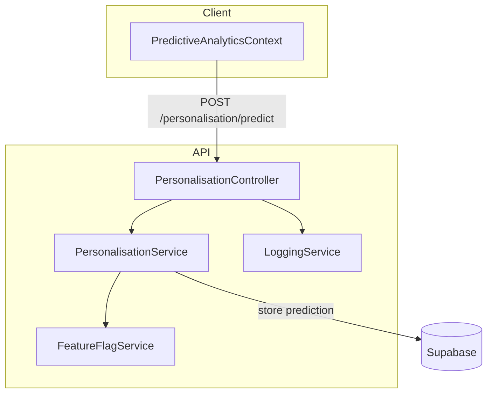

# Point 24 - Audit technique "Personnalisation prédictive ultra-premium"

Ce rapport examine l'état actuel du système de personnalisation prédictive dans le dépôt **EmotionsCare** et propose des axes d'optimisation premium. L'étude couvre la logique métier, la modularité du code, les API utilisées, ainsi que la conformité RGPD et la scalabilité.

## 1. Chemins et modules impliqués

- `/personalisation` : moteur de recommandations (contexte `PredictiveAnalyticsContext`).
- `/b2c/dashboard` et `/b2b/user/dashboard` : consommation des prédictions via `PredictiveFeatureList` et `PredictiveRecommendations`.
- `/b2b/admin/dashboard` : interface d'administration des prédictions (`PredictiveAnalyticsDashboard`).
- Services utilisés : intégrations OpenAI/HumeAI (non encore branchées ici), stockage Supabase, hooks `usePredictiveIntelligence` et `usePredictiveAnalytics`.

## 2. État actuel de l'implémentation

- Les prédictions sont générées localement dans `PredictiveAnalyticsContext.tsx` via un **tirage aléatoire** d'émotions.
- Les recommandations associées sont codées en dur dans `generateRecommendationsForPrediction`.
- Les états `isEnabled` et `predictionEnabled` sont stockés dans `localStorage` mais **aucun log serveur** ni suivi RGPD n'est implémenté.
- Les API d'OpenAI ou de HumeAI ne sont pas appelées pour la partie prédiction ; la fonction simule un délai réseau et renvoie des valeurs prédéfinies.
- Aucune trace de scoring, de versioning ou de journalisation des recommandations n'est présente dans Supabase.
- Aucun module d’A/B testing ou de **FeatureFlagService** n’existe pour tester plusieurs modèles.

## 3. Points forts

- Architecture React/TypeScript claire : les contextes et hooks (`PredictiveAnalyticsProvider`, `usePredictiveAnalytics`) facilitent l’extension future.
- Les composants B2C, B2B et Admin partagent la même logique, ce qui garantit une cohérence de comportement.
- Des tests de base existent et `npm run type-check` passe correctement.

## 4. Limites identifiées

- **Absence de moteur IA réel** : l’algorithme se limite à des valeurs aléatoires, sans connexion aux données historiques ni aux APIs IA.
- **Pas de logs** : aucune trace en base des prédictions générées, des scores ou des décisions prises.
- **Opt‑in/out local uniquement** : l’activation de la personnalisation n’est pas centralisée côté serveur.
- **RGPD non complet** : pas de procédure d’export ou de suppression des données de prédiction.
- **Scalabilité** : la logique est contenue dans un seul contexte, sans séparation en services (moteur, stockage, scoring…).
- **Sécurité & droits** : pas de vérification de rôle ou de token lors de la génération de prédictions.
- **Tests** : aucun test unitaire pour `PredictiveAnalyticsContext` ou `usePredictiveIntelligence`.

## 5. Plan d’optimisation premium

1. **Moteur de personnalisation modulaire**
   - Créer un service `PersonalisationService` côté API pour encapsuler les appels aux modèles IA (OpenAI, HumeAI) et retourner des prédictions typées.
   - Introduire un versioning des algorithmes (`modelVersion` stocké avec chaque prédiction) pour permettre le rollback et la comparaison.
   - Définir des interfaces strictes dans `types/personalisation.ts` pour les entités `Prediction`, `Recommendation`, `ModelVersion`, `UserScore`.

2. **Scoring et logs**
   - Enregistrer chaque prédiction dans Supabase avec `user_id`, horodatage, score de confiance et version du modèle.
   - Centraliser les opt‑in/out par utilisateur dans une table `user_personalisation` (champ `enabled`, date de consentement, trace des modifications).
   - Générer un log anonymisé pour les admins (table `personalisation_logs`) : action réalisée, recommandation suivie ou rejetée, durée avant action.

3. **Automatisation et A/B Testing**
   - Mettre en place un `FeatureFlagService` stocké en base pour activer des variantes de modèles (ex. `model_v1`, `model_v2`).
   - Ajouter un champ `ab_group` pour chaque utilisateur afin de suivre l’impact de chaque modèle sur l’engagement et le taux de satisfaction.
   - Implémenter un tableau de bord d’A/B testing dans `/b2b/admin/dashboard` avec suivi des métriques (taux d’acceptation, progression émotionnelle).

4. **Interface RGPD complète**
   - Créer une API `GET /personalisation/export` et `DELETE /personalisation` permettant aux utilisateurs de récupérer ou d’effacer leurs données prédictives.
   - Documenter la procédure de purge et prévoir une synchronisation avec les données stockées dans Supabase (table `personalisation_logs`).

5. **Sécurité et contrôle d’accès**
   - Utiliser les rôles Supabase ou un middleware API pour vérifier l’identité et les droits avant de générer ou de consulter les prédictions.
   - Journaliser chaque accès aux endpoints dans une table `access_logs` (user, route, date). Préciser la durée de conservation pour la conformité RGPD.

6. **Monitoring et alertes premium**
   - Intégrer Sentry (déjà listé dans les dépendances) pour tracer les erreurs du moteur IA.
   - Prévoir des métriques d’usage (taux de rejet, latence, échecs) exposées dans un dashboard admin.
   - Générer un rapport mensuel automatique (CSV/PDF) récapitulant l’efficacité de la personnalisation pour chaque segment (B2C, B2B, B2B Admin).

7. **Testabilité et simulation**
   - Ajouter des tests unitaires pour `generatePrediction` et `generateRecommendationsForPrediction` avec des jeux de données simulés.
   - Fournir un mode « simulateur IA » dans `PersonalisationService` pour rejouer l’algorithme sur un historique de données fictives.

## 6. Checklist de migration IA

- [ ] Déplacer la logique de génération dans un fichier `src/services/personalisation/engine.ts`.
- [ ] Créer une API REST `POST /personalisation/predict` appelée par `PredictiveAnalyticsContext`.
- [ ] Stocker chaque résultat dans la table `personalisation_predictions` (Supabase).
- [ ] Mettre en place une table `model_versions` pour historiser les changements de modèle.
- [ ] Implémenter l’opt‑in/out centralisé (`user_personalisation`).
- [ ] Ajouter des scripts d’export et de suppression pour la conformité RGPD.
- [ ] Configurer Sentry et les métriques Prometheus/Grafana pour le monitoring.
- [ ] Écrire des tests Vitest couvrant le service de personnalisation.

## 7. Schéma API simplifié

Ce schéma illustre la séparation entre le contexte React côté client et un service dédié côté API, avec persistance des données dans Supabase et gestion des feature flags.

## Conclusion

L’implémentation actuelle fournit une base fonctionnelle mais rudimentaire pour la personnalisation prédictive. Pour atteindre un niveau **ultra-premium**, il est recommandé d’externaliser le moteur de prédiction, de journaliser chaque décision, de mettre en place un suivi RGPD complet et d’introduire des mécaniques d’A/B testing. Ces améliorations garantiront une expérience personnalisée fiable, sécurisée et évolutive pour tous les profils utilisateurs.

