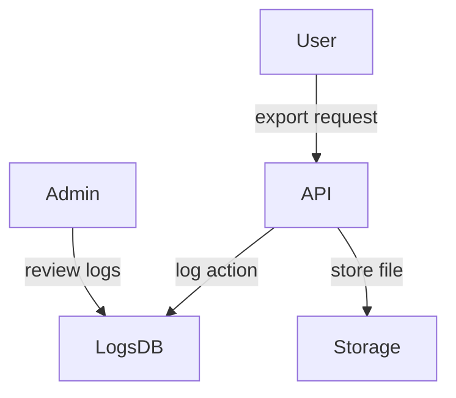

# Reporting avancé et transparence - Audit technique

Ce document dresse l'état actuel des structures de reporting de **EmotionsCare** et propose des améliorations premium pour renforcer la traçabilité et la conformité RGPD.

## 1. Modules et chemins analysés

Les routes liées au reporting sont centralisées dans `src/types/navigation.ts` :

```ts
   122    b2bAdmin: {
   123      home: '/b2b/admin',
   124      login: '/b2b/admin/login',
   125      dashboard: '/b2b/admin/dashboard',
   126      journal: '/b2b/admin/journal',
   127      scan: '/b2b/admin/scan',
   128      music: '/b2b/admin/music',
   129      coach: '/b2b/admin/coach',
   130      vr: '/b2b/admin/vr',
   131      teams: '/b2b/admin/teams',
   132      reports: '/b2b/admin/reports',
   133      events: '/b2b/admin/events',
   134      settings: '/b2b/admin/settings',
   135      optimisation: '/b2b/admin/optimisation',
   136      extensions: '/extensions'
```

Ces chemins couvrent l'accès admin aux dashboards, rapports et exports. Les utilisateurs B2C et B2B user accèdent à leurs données personnelles via des pages dédiées (`/b2c/dashboard`, `/b2b/user/dashboard`).

## 2. Structuration des données de reporting

Le typage des analytics est défini dans `src/types/analytics.ts` :

```ts
     2  export interface AnonymizedEmotion {
     3    id: string;
     4    emotion: string;
     5    intensity: number;
     6    timestamp: string;
     7    department?: string;
     8    team?: string;
     9    anonymizedUserId: string;
    10  }
    11
    12  export interface TeamAnalytics {
    13    teamId: string;
    14    teamName: string;
    15    memberCount: number;
    16    averageScore: number;
    17    topEmotions: { emotion: string; count: number }[];
    18    emotionalTrend: number[];
    19    engagementRate: number;
    20  }
```

Les logs administrateur et les exports utilisateurs reposent sur les types `AdminAccessLog` et `DataExportRequest` :

```ts
    76  export interface AdminAccessLog {
    77    id: string;
    78    adminId: string;
    79    action: string;
    80    timestamp: string;
    81    userName?: string;
    82    resource?: string;
    83    ip?: string;
    84    adminName?: string;
    85    userId?: string;
    86    details?: string;
    87  }
```

```ts
    64  export interface DataExportRequest {
    65    id: string;
    66    userId: string;
    67    requestDate: string;
    68    status: 'pending' | 'processing' | 'completed' | 'failed';
    69    format: 'json' | 'csv' | 'pdf' | 'zip';
    70    expiresAt?: string;
    71    downloadUrl?: string;
    72    includedData: string[];
    73  }
```

## 3. Services d'analytics et génération IA

Le service `fetchTeamAnalytics` illustre la récupération des statistiques d'équipe :

```ts
     1  import { TeamAnalytics } from '@types/analytics';
     4  * Fetches aggregated emotional analytics for a team.
     7  export async function fetchTeamAnalytics(teamId: string): Promise<TeamAnalytics> {
     9    await new Promise(resolve => setTimeout(resolve, 500));
    11    // Sample data. Real implementation should query Supabase.
    19    return {
    20      teamId,
    21      teamName: `Team ${teamId}`,
    22      memberCount: 12,
    23      averageScore: emotionalTrend.reduce((acc, v) => acc + v, 0) / emotionalTrend.length,
    24      topEmotions,
    25      emotionalTrend,
    26      engagementRate: 0.75
    27    };
    28  }
```

La génération de synthèses IA utilise le hook `useOpenAI` :

```ts
    18  * Génère du texte avec OpenAI
    20  const generateText = async (prompt: string, options: OpenAIOptions = {}) => {
    21    setIsLoading(true);
    25      const result = await openai.generateText(prompt, options);
    26      return result;
```

## 4. Conformité et logs RGPD

Les structures RGPD sont décrites dans `src/types/privacy.ts` :

```ts
     2  export type GdprRequestType = 'access' | 'rectification' | 'deletion' | 'portability' | 'objection' | 'restriction';
     6  export interface GdprRequest {
     7    id: string;
     8    userId: string;
    10    requestType: GdprRequestType;
    11    status: GdprRequestStatus;
    12    submittedAt: string;
    13    dueDate: string;
    14    completedAt?: string;
    15    rejectionReason?: string;
    16    details?: string;
    17  }

    27  export interface AccessLog {
    28    id: string;
    29    userId: string;
    30    timestamp: string;
    31    action: string;
    32    ip: string;
    33    device: string;
    34    location?: string;
    35    status: 'success' | 'warning' | 'error';
    36    details?: string;
    37  }
```

Les pages personnelles permettent la demande d'export ou de suppression :

```ts
    75  const requestFullDataExport = () => {
    76    toast({
    77      title: "Demande envoyée",
    78      description: "Votre export de données sera disponible sous 48h et vous sera envoyé par email"
    79    });
    80  };
```

## 5. Schéma des flux d'export



## 6. Plan d'extension et suggestions premium

- Centraliser la génération des exports via un `ExportService` unique (CSV, PDF, JSON).
- Ajouter une API batch pour les demandes massives côté admin avec suivi d'état.
- Historiser chaque analyse IA avec version du modèle et signature de conformité.
- Prévoir un système d'alertes en cas d'accès anormal ou de tentative d'export non autorisée.
- Générer automatiquement des synthèses mensuelles personnalisées pour chaque utilisateur.

## 7. Checklist RGPD

- [ ] Journaliser toutes les consultations de rapports sensibles.
- [ ] Garantir la portabilité complète des données via `DataExportRequest`.
- [ ] Prévoir un mécanisme d'effacement sur demande avec trace d'audit.
- [ ] Documenter la durée de conservation des logs et exports.

---

Ce rapport complète l'audit global de la plateforme. Les améliorations proposées visent à assurer une transparence accrue des opérations de reporting et une conformité forte aux exigences européennes.

