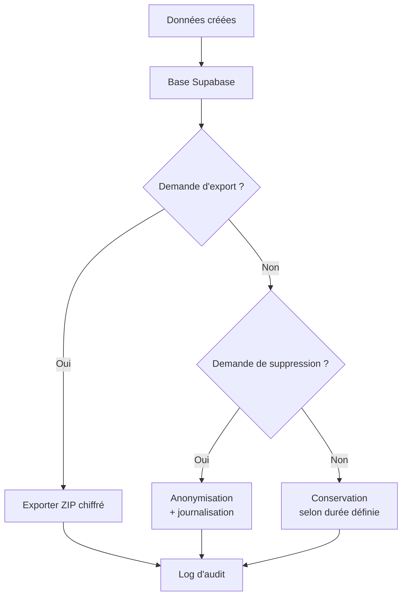

# Point 16 - Gestion responsable et éthique des données

Ce document analyse l’état actuel du dépôt concernant la gestion responsable et éthique des données (logs, consentement, anonymisation, RGPD). Il complète le rapport partiel « Point 12 » et sert de base à l’implémentation d’une architecture éthique.

## 1. Contextes et providers observés

- `AuthContext` et `SessionContext` gèrent l’authentification et stockent la session dans `localStorage`.
- `UserPreferencesContext` centralise les préférences (incluant `PrivacyPreferences`).
- Aucune `EthicsContext` ou `AuditContext` n’existe pour tracer les accès ou gérer les consentements.
- Le type `AdminAccessLog` défini dans `src/types/dashboard.ts` n’est pas exploité par un provider global.

## 2. Typage et entités liées à la privacy

- Les préférences utilisateur comportent une section `PrivacyPreferences` (partage des données, anonymisation, etc.).
- Aucun fichier `types/ethics.ts` ou `types/privacy.ts` ne réunit l’ensemble des entités (log, consentement, anonymisation). Certains types utilisent `any` (ex. `SessionContext`).
- Les fonctions Supabase incluent `gdpr-assistant` et `explain-gdpr`, mais leurs réponses ne sont pas typées côté client.

## 3. Gestion actuelle des droits et des logs

- Aucun module de journalisation centralisé n’est présent. Les pages admin affichent un tableau d’exemple `AccessLogsTable` avec des données simulées.
- Les accès aux fonctions Supabase utilisent `requireAuth`, mais il n’existe pas de suivi des actions (export, suppression, etc.).

## 4. Export, effacement et anonymisation

- Aucune API d’export des données utilisateur n’est implémentée.
- Le `UserPreferencesContext` prévoit un `resetPreferences` local sans effacement serveur.
- Les documents indiquent des idées de persistance et d’effacement mais rien de fonctionnel.

## 5. Transparence et politique de confidentialité

- `CompliancePage.tsx` mentionne la certification SOC 2 et HDS, mais la politique éthique et le suivi des logs ne sont pas accessibles à l’utilisateur.
- Aucun endpoint n’expose les journaux ou l’historique des droits.

## 6. Recommandations principales

1. **Créer `EthicsContext`/`AuditContext`** : provider injecté dans `AppProviders` pour loguer chaque action (connexion, modification, export). Stockage Supabase avec typage strict.
2. **Centraliser les types** dans `src/types/ethics.ts` : `AuditLog`, `ConsentRecord`, `DataRequest`, `AnonymizationEvent`... Aucun `any`.
3. **Consentement explicite** : page de gestion du consentement reliée au context, conservation des logs de consentement.
4. **API d’export et de suppression** : endpoints Supabase protégés permettant à l’utilisateur de récupérer ou d’effacer ses données.
5. **Anonymisation dynamique** : service appliquant un hachage/ pseudonymisation sur demande (voir diagramme ci‑dessous).
6. **Transparence** : page ou API affichant la politique éthique, les logs récents et les droits en cours.
7. **Tests et lint** : exécuter `npm run lint`, `npm run type-check` et ajouter des tests unitaires pour les modules d’audit et d’export.

## 7. Schéma de cycle de vie des données (exemple)

## 8. Tests à prévoir

- Unitaires : validation des schémas `AuditLog` et `ConsentRecord`.
- Intégration : export complet des données, anonymisation sur demande, vérification du log créé.
- Scripts QA : exécution de `npm run lint`, `npm run type-check` et `npm run test`.

## 9. Propositions d’évolution

- Score de privacy par utilisateur avec recommandations.
- Journal d’audit consultable en temps réel par l’administrateur.
- Choix de la région de stockage et traçabilité des transferts internationaux.

---

Ce rapport constitue la base du **Point 16** pour instaurer une gestion éthique et responsable des données sur EmotionsCare. Un plan de mise en œuvre détaillé devra être validé avec le Product Owner avant l’intégration en production.
