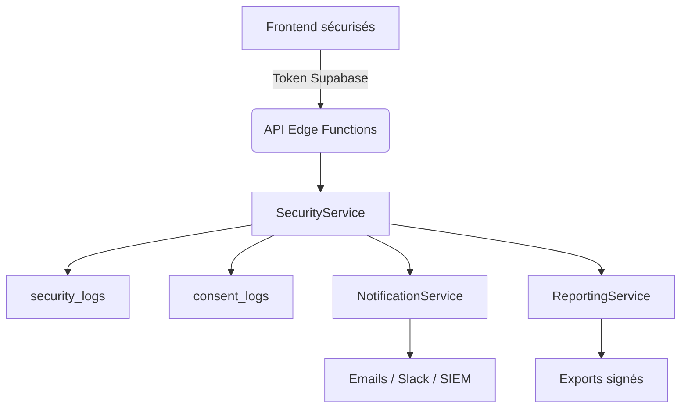

# Point 22 - Gestion proactive des risques & sécurité immersive

Ce document détaille l'audit technique de la plateforme **EmotionsCare** pour la gestion proactive des risques et la sécurité immersive. Il complète les rapports précédents (`security-privacy-audit-point12.md`, `privacy-security-audit-point16.md`) en se concentrant sur la prévention, la détection, la réaction et la traçabilité.

## 1. Utilisateurs concernés

- **B2C (particulier)** : sécurité de session, notifications d'incident, gestion MFA, droits RGPD
- **B2B User (collaborateur)** : détection d'anomalie sur le compte, logs d'accès, notifications en cas de faille ou de modification
- **B2B Admin (RH/Admin)** : accès au dashboard sécurité, audit global, logs complets, configuration MFA, gestion des droits et alertes

## 2. Modules et services observés

- `AuthProvider` et `ProtectedRoute` assurent l'authentification et la restriction par rôle (`b2c`, `b2b_user`, `b2b_admin`).
- Les fonctions Supabase (`supabase/functions/*`) utilisent `requireAuth` pour contrôler l'accès.
- `NotificationService` et `AuditLog` ne sont pas encore centralisés dans un service unique.

## 3. Gestion proactive des risques

1. **Centralisation des logs** : prévoir un `SecurityService` chargé de collecter les événements (login, logout, changement de droits, tentatives de brute force) et de les stocker dans une table `security_logs` sécurisée par RLS.
2. **Détection de patterns suspects** : implémenter un module d'analyse (ex. `RiskAnalyzer`) capable de repérer les connexions multiples, les horaires inhabituels ou les tentatives d'élévation de privilèges.
3. **Automatisation des réponses** : blocage temporaire ou demande de MFA lors d'un comportement suspect, purge de session et notification immédiate de l'utilisateur et des administrateurs.
4. **Simulation d'attaque interne** : créer un script de test permettant de simuler un brute force ou une modification de droits pour vérifier les alertes et la réactivité du système.

## 4. Politiques d'accès, MFA et droits

- Mise en place d'une politique de mot de passe renforcée (longueur, complexité, expiration, blacklist partagée).
- Champ `mfa_enabled` dans le profil utilisateur et service de validation OTP ou application tierce.
- RBAC factorisé : chaque endpoint API et chaque route serveur doit vérifier le rôle via `ProtectedRoute` ou un guard côté fonction.
- Journalisation systématique des créations, suppressions et modifications de droits.

## 5. Alertes, logs et monitoring

1. **Logs structurés** : format JSON avec `timestamp`, `user_id`, `event_type`, `ip`, `user_agent` et `details`.
2. **Export sécurisé** : fourniture d'une route d'export CSV/PDF pour les admins (`/security/export-logs`) avec signature ou hash vérifiable.
3. **Monitoring temps réel** : intégration de Sentry (ou équivalent) pour remonter immédiatement les erreurs critiques et afficher un tableau de bord "Security Health" dans `/b2b/admin/dashboard`.
4. **Retention et purge** : politique de conservation configurable, avec suppression ou anonymisation sur demande RGPD.

## 6. Conformité & RGPD

- Enregistrement du consentement pour chaque action sensible (export, suppression de données, changement de rôle).
- Tables `consent_logs` et `audit_logs` séparées, protégées par RLS, avec possibilité d'export pour audit externe.
- Vérification OWASP (top 10) sur toutes les fonctions Edge : validation d'entrée, protection CSRF, usage limité de la `service_role_key`.
- Plan de réponse automatisé : génération d'un rapport d'incident, envoi aux parties prenantes et suivi des actions correctives.

## 7. Suggestions premium

- **Modularité** : isoler `SecurityService`, `NotificationService` et `ReportingService` pour permettre l'extension multi-site et la montée en charge.
- **Réactivité** : pipeline d'alertes configurable vers e-mail, Slack ou SIEM externe.
- **Automatisation** : feature flags pour activer/désactiver rapidement MFA, logs ou modules spécifiques.
- **Scalabilité** : partitionnement des tables de logs, archivage automatique et cache pour les dashboards.
- **Certification des exports** : ajout d'une signature ou d'un hash pour chaque fichier d'export afin de garantir l'intégrité.

## 8. Schéma d'architecture de surveillance



## 9. Checklist RGPD / OWASP

- [ ] Stockage sécurisé des sessions (cookies `httpOnly` en production)
- [ ] Règles RLS strictes pour `security_logs` et `consent_logs`
- [ ] Droit d'accès, de rectification et de suppression accessible via `/security`
- [ ] Analyse OWASP (validation d'entrée, limite brute force, CORS restreints)
- [ ] Revue régulière du code et des dépendances (`npm audit`)
- [ ] Tests unitaires et d'intégration pour tous les modules de sécurité

## 10. Scénario de test d'incident (exemple)

1. Un utilisateur effectue 5 tentatives de connexion échouées en moins de 2 minutes.
2. `RiskAnalyzer` enregistre les tentatives dans `security_logs` et déclenche une alerte.
3. Le compte est temporairement verrouillé, une notification MFA est demandée.
4. L'administrateur reçoit un e-mail résumant l'incident et peut consulter les logs détaillés dans le tableau de bord.

## 11. Exemple de log d'audit

```json
{
  "timestamp": "2025-05-01T10:15:30Z",
  "user_id": "b2b_admin_42",
  "event_type": "role_update",
  "ip": "203.0.113.5",
  "user_agent": "Mozilla/5.0",
  "details": {
    "previous_role": "b2b_user",
    "new_role": "b2b_admin"
  }
}
```

---

Ce rapport sert de base pour la mise en œuvre du **Point 22**. Les modules proposés doivent être validés avec le Product Owner avant intégration en production.
