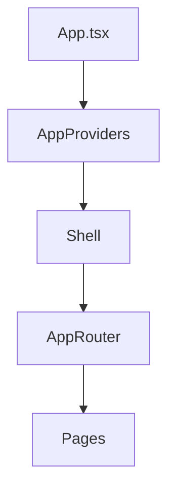

# Audit technique - Point 4 : Shell, layout général et navigation premium

Ce document synthétise l'état actuel du Shell principal et de la navigation.
Il complète `docs/layout-shell-audit.md` et `docs/shell-navigation-premium-audit.md` en rappelant la hiérarchie des providers et les points vérifiés lors de l'audit.

## Schéma global

`AppProviders` encapsule tous les contextes globaux, désormais y compris `LayoutProvider` pour le sidebar et le mode plein écran.

## Hiérarchie des contextes

1. `ThemeProvider`
2. `AuthProvider`
3. `UserPreferencesProvider`
4. `UserModeProvider`
5. `LayoutProvider`
6. `MusicProvider`
7. `OptimizationProvider`
8. `ExtensionsProvider`
9. `OrchestrationProvider`
10. `OnboardingProvider`
11. `SupportProvider`

Cette hiérarchie assure que les informations d'authentification, de préférences et de mise en page sont accessibles dans l'ensemble de l'application.

## Navigation et routing

- Le routage principal est géré par `AppRouter` et englobe toutes les routes B2C et B2B.
- Les layouts B2B utilisent leurs propres composants (`B2BUserLayout`, `B2BAdminLayout`).
- Les pages publiques et utilitaires sont encapsulées directement dans `Shell`.

## Conventions de typage

- Les interfaces du layout sont définies dans `src/types/layout.ts`.
- Chaque contexte exporte ses propres types pour éviter le `any`.
- Les chemins de navigation sont répertoriés dans `src/types/navigation.ts`.

## Points de vérification

- Pas de double layout : `Shell` centralise header, footer et barre de navigation.
- `AppProviders` injecte les contextes dans l'ordre précisé ci-dessus.
- Les pages utilisent `Shell` ou un layout B2B pour rester cohérentes.
- Les tests unitaires valident la présence des exports des contextes.

## Améliorations suggérées

- Charger en lazy loading les modules volumineux (coach, settings).
- Envisager un store léger pour synchroniser la navigation.
- Préparer la compatibilité SSR/CSR pour une future migration Next.js.
