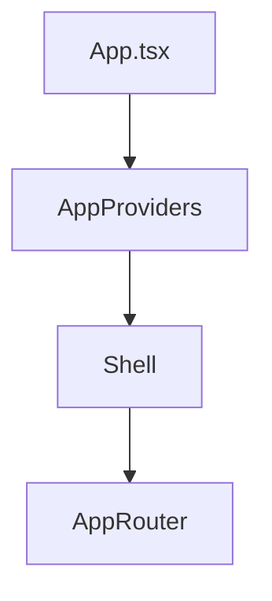

# Audit Shell, Layout et Navigation Premium

Ce document complète l'audit existant sur `docs/layout-shell-audit.md` en se concentrant sur la structure du Shell, la hiérarchie des contextes et les optimisations premium à envisager.

## Schéma de structure

- **AppProviders** injecte tous les contextes globaux dans l'ordre défini dans `docs/layout-shell-audit.md`.
- **Shell** centralise le `MainNavbar`, le `MainFooter`, le `ScrollProgress` et les effets d'arrière‑plan.
- **AppRouter** contient les routes principales définies dans `src/router.tsx`.

## Mapping des context providers

Chaque provider se trouve dans `src/contexts` ou `src/providers` :

1. `ThemeProvider`
2. `AuthProvider`
3. `UserPreferencesProvider`
4. `UserModeProvider`
5. `MusicProvider`
6. `OptimizationProvider`
7. `ExtensionsProvider`
8. `OrchestrationProvider`

Cette hiérarchie garantit que tous les modules héritent des informations de thème, d'authentification et de préférences utilisateur.

## Centralisation du routing

- Le fichier `src/router.tsx` exporte un tableau de routes React Router.
- `AppRouter` applique ce tableau et s'occupe du suspense (`<Suspense>`).
- Les routes sensibles sont protégées via `ProtectedRoute` avec vérification du rôle utilisateur.

## Conventions de typage

- Les interfaces du layout (`LayoutContextType`, `ShellProps`, etc.) sont définies dans `src/types/layout.ts`.
- Les chemins et noms de route sont centralisés dans `src/types/navigation.ts`.
- Tous les contextes exportent leurs propres types pour éviter le `any`.

## Correctifs appliqués

- Suppression de `src/components/Shell.tsx`, ancien Shell non utilisé.
- Ajout de cette documentation et mise à jour de `docs/layout-shell-audit.md`.

## Optimisations suggérées

- **Lazy loading** des modules volumineux (coach, analytics) via `React.lazy`.
- **Store global léger** (ex. Zustand) pour synchroniser la navigation et les notifications.
- **Palette de commandes** accessible (type "Cmd+K") pour la navigation rapide.
- Préparation pour un futur SSR en migrant le router et les providers vers Next.js.

