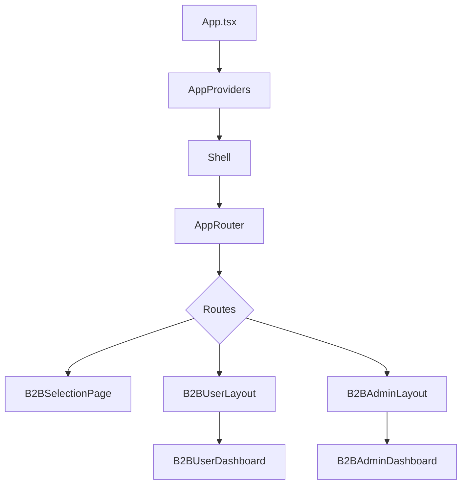

# Audit Shell, Layout et Navigation Premium

Ce document complète l'audit existant sur `docs/layout-shell-audit.md` en se concentrant sur la structure du Shell, la hiérarchie des contextes et les optimisations premium à envisager.

## Schéma de structure

- **AppProviders** injecte tous les contextes globaux dans l'ordre défini dans `docs/layout-shell-audit.md`.
- **Shell** centralise le `MainNavbar`, le `MainFooter`, le `ScrollProgress` et les effets d'arrière‑plan.
- **AppRouter** contient les routes principales définies dans `src/router.tsx` avec des transitions animées entre pages.
- Les layouts **B2BUserLayout** et **B2BAdminLayout** offrent une expérience utilisateur premium avec un menu latéral animé et adaptatif.

## Mapping des context providers

Chaque provider se trouve dans `src/contexts` ou `src/providers` :

1. `ThemeProvider`
2. `AuthProvider`
3. `UserPreferencesProvider`
4. `UserModeProvider`
5. `LayoutProvider`
6. `MusicProvider`
7. `OptimizationProvider`
8. `ExtensionsProvider`
9. `OrchestrationProvider`

Cette hiérarchie garantit que tous les modules héritent des informations de thème, d'authentification et de préférences utilisateur.

## Améliorations premium implémentées

- **Transitions animées** entre pages avec Framer Motion pour un effet de fluidité (fade, slide)
- **Menu latéral intelligent** qui se rétracte sur mobile et s'adapte au contenu
- **Connexion/inscription stylisée** avec effets visuels et feedback utilisateur 
- **Animations micro-interactions** sur les boutons, cards et icônes
- **Toasts de notification** pour les actions importantes (connexion, déconnexion)
- **Protection de routes intelligente** qui redirige automatiquement les utilisateurs
- **Affichage conditionnel** des informations utilisateur selon le rôle
- **Feedback tactile** sur appareils mobiles via API vibration
- **Marquage visuel des sections actives** dans la navigation
- **Messagerie d'accueil personnalisée** selon l'heure et le nom de l'utilisateur

## Centralisation du routing

- Le fichier `src/router/index.tsx` exporte un tableau de routes React Router.
- `AppRouter` applique ce tableau et s'occupe du suspense (`<Suspense>`) et des transitions animées.
- Les routes sensibles sont protégées via `ProtectedRoute` avec vérification du rôle utilisateur.
- Le hook personnalisé `usePreferredAccess` gère les redirections automatiques pour une UX fluide.

## Conventions de typage

- Les interfaces du layout (`LayoutContextType`, `ShellProps`, etc.) sont définies dans `src/types/layout.ts`.
- Les chemins et noms de route sont centralisés dans `src/types/navigation.ts`.
- Tous les contextes exportent leurs propres types pour éviter le `any`.

## Fonctionnalités accessibilité

- Navigation au clavier fonctionnelle (tabindex, focus visible)
- Support des lecteurs d'écran (aria-label, aria-role)
- Contraste optimal en modes clair et sombre
- Retour visuel clair sur les éléments interactifs
- Messages de statut pour les actions importantes

## Feedback UX amélioré

- Toasts de notification pour les actions utilisateur (connexion, déconnexion, etc.)
- États de chargement avec spinners et animations
- Micro-animations sur hover des éléments interactifs
- Transitions fluides entre les pages et composants
- Feedback tactile sur mobile (vibration)

## Prochaines améliorations suggérées

- **Command palette** (type Cmd+K) pour navigation rapide
- **Palette de commande vocale** pour accessibilité renforcée
- **Skeleton loaders** pour les charges asynchrones non couvertes
- **Animations contextuelles** selon l'état émotionnel détecté de l'utilisateur
- **Dashboard générateur de rapport** pour les admins B2B
