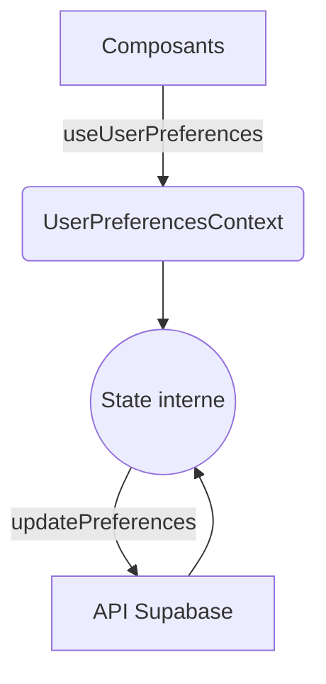

# UserPreferencesContext

Ce contexte global centralise l'ensemble des préférences utilisateur.
Il est déclaré dans `src/contexts/UserPreferencesContext.tsx`.

## API du contexte

```ts
export interface UserPreferencesContextType {
  preferences: UserPreferences;
  theme: string;
  fontSize: string;
  language: string;
  notifications: NotificationsPreferences;
  privacy: string | PrivacyPreferences;
  updatePreferences: (preferences: Partial<UserPreferences>) => Promise<void>;
  resetPreferences?: () => void;
  isLoading?: boolean;
  error?: Error | null;
}
```

## Flow des données



## Persistance

À ce jour, le provider conserve les préférences en mémoire.
Pour une meilleure expérience et une conformité RGPD, on recommande d'ajouter :

- Synchronisation avec Supabase pour sauvegarder les modifications.
- Optionnellement un stockage local (localStorage) pour précharger les préférences.
- Une méthode de suppression complète des préférences à la demande de l'utilisateur.
