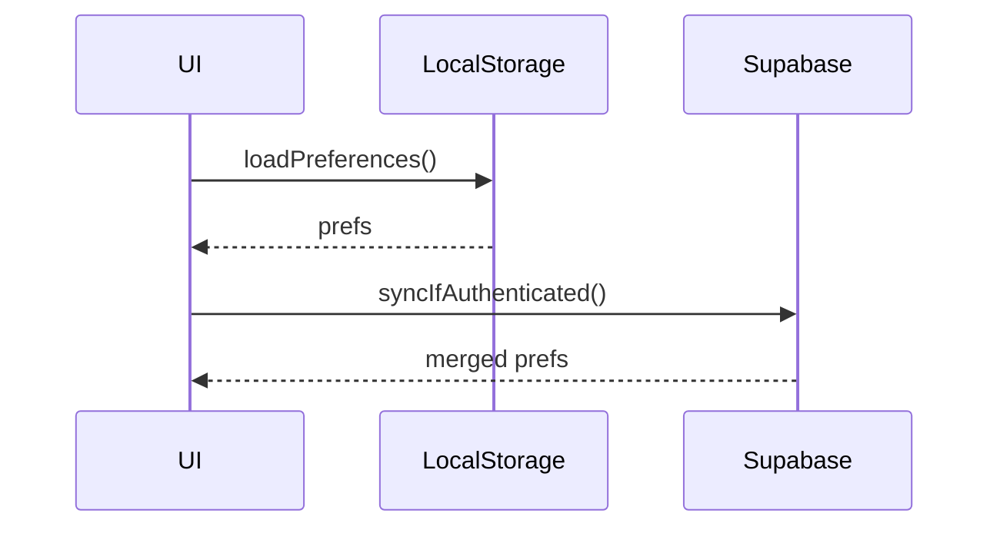

# Point 7 - Audit du module Paramètres utilisateur & personnalisation

Ce rapport détaille l'état actuel du contexte **UserPreferences** et des routes de réglages. Il complète `docs/user-preferences-premium-audit.md` en apportant un mapping précis des fichiers et des recommandations de mise à jour.

## 1. Mapping actuel

```mermaid
flowchart TD
    A[AppProviders] --> B(UserPreferencesProvider)
    B --> C(Use in hooks/pages)
    C -->|useUserPreferences| D[src/hooks/useUserPreferences.ts]
    C -->|usePreferences (legacy)| E[src/hooks/usePreferences.ts]
```

- `UserPreferencesContext.tsx` définit `UserPreferencesProvider` et le hook `useUserPreferences`.
- `PreferencesContext.tsx` est encore présent mais ne doit plus être utilisé.
- Plusieurs pages (`src/pages/b2c/Settings.tsx`, `src/pages/UserPreferences.tsx`) conservent un état local et ignorent le provider.

## 2. Schéma JSON des préférences

```ts
export interface UserPreferences {
  theme?: Theme;
  fontSize?: FontSize;
  fontFamily?: FontFamily;
  language?: string;
  notifications?: NotificationsPreferences | boolean;
  privacy?: PrivacyPreferences | 'private' | 'public';
  vibration?: boolean;
  soundEffects?: boolean;
  darkMode?: boolean;
  // ...
}
```

La constante `DEFAULT_PREFERENCES` dans `src/types/preferences.ts` sert de base pour l'initialisation.

## 3. Persistance et synchronisation

- `UserPreferencesProvider` conserve l'état en mémoire uniquement.
- Le hook `usePreferences` stocke des valeurs dans `localStorage` via `useLocalStorage` mais n'est pas relié au provider global.
- Aucun mécanisme n'existe pour synchroniser avec Supabase ou résoudre les conflits.

### Diagramme proposé



## 4. Correctifs et améliorations prioritaires

1. **Supprimer `PreferencesContext.tsx`** et migrer tous les consommateurs vers `useUserPreferences`.
2. **Persistance locale** : intégrer `useLocalStorage` directement dans `UserPreferencesProvider`.
3. **Synchronisation serveur** : ajouter un service `preferencesService` (Supabase) avec export, import et réinitialisation.
4. **Tests** : compléter `npm run test` avec des cas `updatePreferences`, `resetPreferences` et vérification RGPD.

## 5. Pistes d'évolution premium

- Ajout d'un champ `preferencesVersion` pour faciliter les migrations.
- Support de profils multiples (perso, pro, invité) via un sélecteur dans le provider.
- Historique chiffré des modifications et fonction de rollback.
- Suggestions automatiques de préférences selon l'usage et l'heure de la journée.
- Deep‑linking des sections `/settings` pour faciliter l'onboarding.

---

Ce point d'audit résume la situation du module de préférences et prépare l'arrivée des fonctionnalités avancées tout en assurant la conformité RGPD.
