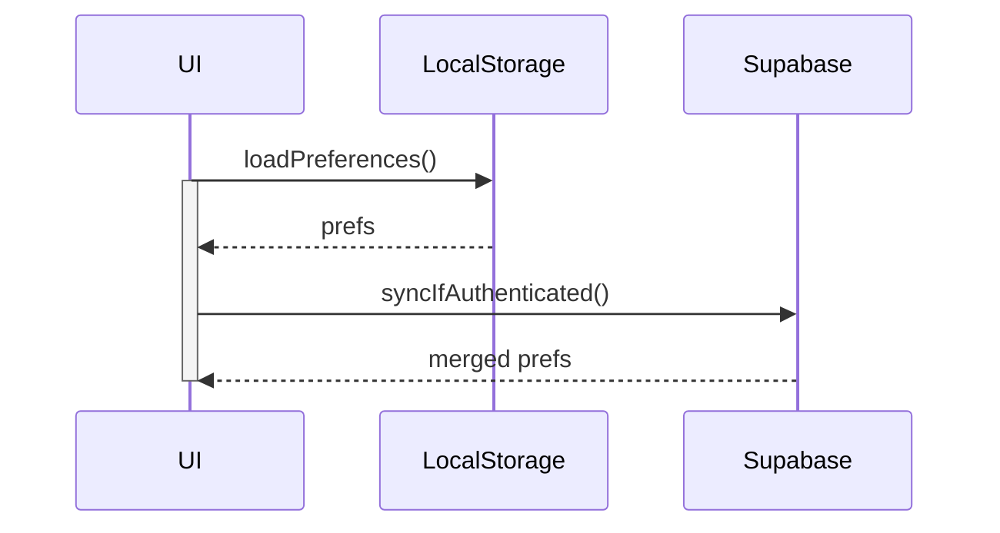

# Audit technique – Module Paramètres utilisateur & personnalisation

Ce rapport analyse l'état actuel du **UserPreferencesContext** et de la route `/settings` afin de garantir une base solide pour les futures personnalisations avancées.

## 1. Centralisation des préférences

- Le provider `UserPreferencesProvider` est injecté dans `AppProviders` ce qui rend les préférences disponibles dans tout le layout.
- Un ancien `PreferencesContext` persiste dans `src/contexts/PreferencesContext.tsx` et certains hooks (ex. `usePreferences`) s'y réfèrent encore, notamment dans `useAmbientSound` et `ImmersiveHome`. Cela crée une divergence potentielle d'état.

```tsx
// src/contexts/PreferencesContext.tsx
export const PreferencesProvider: React.FC<{ children: React.ReactNode }> = ({ children }) => {
  const [preferences, setPreferences] = useState<UserPreferences>(DEFAULT_PREFERENCES);
  // ...
};
```

**Recommandation** : supprimer ce contexte obsolète et migrer tous les consommateurs vers `useUserPreferences`.

## 2. Typage et schéma JSON

- Les interfaces sont centralisées dans `src/types/preferences.ts` et exposent `UserPreferences` ainsi que `NotificationsPreferences` et `PrivacyPreferences`.
- Le schéma par défaut est défini dans `DEFAULT_PREFERENCES`.

```ts
export const DEFAULT_PREFERENCES: UserPreferences = {
  theme: 'system',
  fontSize: 'md',
  language: 'fr',
  notifications: {
    enabled: true,
    emailEnabled: true,
    pushEnabled: false,
    inAppEnabled: true,
    frequency: 'daily',
    quietHours: { enabled: false, from: '22:00', to: '08:00' },
    tone: 'friendly'
  },
  privacy: 'private',
  vibration: true,
  // ...
};
```

Le type strict offre une base saine pour des évolutions versionnées du schéma.

## 3. Persistance et synchronisation

- `UserPreferencesProvider` stocke l'état uniquement en mémoire. Aucune lecture/écriture dans `localStorage` ou Supabase n'est réalisée.
- Un hook séparé `usePreferences` gère la persistance via `useLocalStorage` mais n'est pas relié au provider global.
- Aucun mécanisme de synchronisation serveur n'est présent.

**Recommandations**

1. Ajouter une persistance locale sécurisée (chiffrement léger possible) pour précharger les préférences hors ligne.
2. Mettre en place une synchronisation avec Supabase à chaque connexion ou modification, avec détection de conflit et journalisation.
3. Prévoir une API `resetPreferences` côté serveur pour répondre aux demandes RGPD (effacement complet).

## 4. Gestion RGPD

- La réinitialisation locale est prévue (`resetPreferences`), mais il manque un export des données et un effacement serveur.
- Aucun historique ni logs de consentement ne sont conservés.

**Pistes d'amélioration**

- Endpoint d'export `GET /user/preferences/export` renvoyant un fichier JSON.
- Fonction `erasePreferences()` pour supprimer toutes les données côté serveur (loguée et confirmée par l'utilisateur).

## 5. Propositions premium

- **Versionnage du schéma** : ajouter un champ `preferencesVersion` pour faciliter les migrations futures.
- **Profils multiples** : permettre de stocker plusieurs ensembles de préférences (perso, pro, invité) avec un sélecteur dans le context.
- **Historique et rollback** : conserver un historique chiffré des modifications et offrir un undo/redo.
- **Centre de préférences IA** : analyser l'usage et suggérer automatiquement des réglages (activables/désactivables).
- **Deep‑linking** : chaque sous-onglet de `/settings` pourrait être ouvert via une ancre ou un paramètre d'URL.
- **Tests automatisés** : scénarios de migration, conflits de sync, export/import JSON, accessibilité.

## 6. Diagramme de synchronisation proposé



## 7. Tests existants et manquants

- Quelques tests unitaires sur la normalisation des préférences sont présents.
- Les suites `npm run test` échouent actuellement par absence de `ts-node`.
- Aucun test d'intégration pour la route `/settings` ni pour la persistance.

**À prévoir** : tests sur `updatePreferences`, reset usine, import/export et détection de conflit lors de la sync.

---

En conclusion, la base actuelle fournit un contexte unique mais la présence d'un ancien provider et l'absence de persistance nuisent à la robustesse. Les améliorations ci-dessus permettront de préparer l'arrivée de fonctionnalités premium tout en respectant la conformité RGPD.
