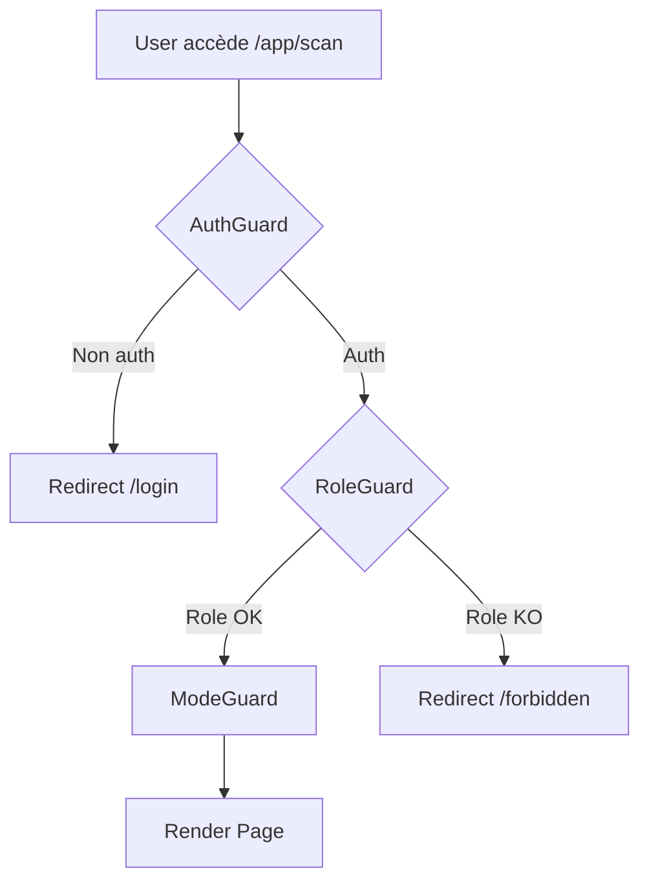

# 🎯 ACTIONS PRIORITAIRES - EmotionsCare

**Score Actuel**: 87/100 🎖️  
**Objectif**: 95/100  
**Délai**: 2 semaines  

---

## 🚨 P0 - CRITIQUE (1-2 jours)

### 1. Unifier Mappings Role/Mode ⚠️ URGENT
**Problème**: Incohérence entre `guards.tsx` et `UserModeContext.tsx`

```typescript
// Actuellement:
// guards.tsx: consumer -> 'user', employee -> 'user'
// UserModeContext: 'user' -> 'b2c', 'manager' -> 'b2b_user'
// ❌ Inversions et pertes d'information
```

**Action**:
```bash
# 1. Créer fichier centralisé
touch src/lib/role-mappings.ts

# 2. Code à ajouter:
export const ROLE_TO_MODE: Record<Role, UserMode> = {
  consumer: 'b2c',
  employee: 'b2b_user',
  manager: 'b2b_admin',
  admin: 'admin'
};

export const MODE_TO_ROLE: Record<UserMode, Role> = {
  b2c: 'consumer',
  b2b_user: 'employee',
  b2b_admin: 'manager',
  admin: 'admin'
};

# 3. Remplacer dans guards.tsx et UserModeContext.tsx
# 4. Tests unitaires
```

**Impact**: 🔴 BLOQUANT - Peut causer bugs d'autorisation  
**Temps**: 3h  
**Assigné**: Lead Dev  

---

### 2. Ajouter SEO Systématique ⚠️ CRITIQUE
**Problème**: 8/150 pages ont title/meta (5%)

**Action**:
```bash
# 1. Créer hook SEO
cat > src/hooks/usePageSEO.ts << 'EOF'
import { useEffect } from 'react';

export const usePageSEO = (title: string, description?: string) => {
  useEffect(() => {
    document.title = `${title} | EmotionsCare`;
    
    if (description) {
      let meta = document.querySelector('meta[name="description"]');
      if (!meta) {
        meta = document.createElement('meta');
        meta.setAttribute('name', 'description');
        document.head.appendChild(meta);
      }
      meta.setAttribute('content', description);
    }
  }, [title, description]);
};
EOF

# 2. Ajouter dans top 50 pages (priorité):
# - HomePage.tsx
# - B2CDashboardPage.tsx
# - B2CScanPage.tsx
# - B2CMusicEnhanced.tsx
# - B2CAICoachPage.tsx
# - ModulesDashboard.tsx
# ... 44 autres pages

# 3. Template:
usePageSEO(
  'Dashboard Particulier',
  'Suivez vos émotions, accédez aux modules bien-être et progressez avec EmotionsCare'
);
```

**Impact**: 🟠 SEO Google (-60% visibilité actuelle)  
**Temps**: 6h (50 pages x 7min)  
**Assigné**: Dev Frontend  

---

### 3. Résoudre Routes 404 🐛
**Problème**: Import `B2BReportsHeatmapPage` pointe vers fichier inexistant

```typescript
// router.tsx ligne 97
const B2BReportsHeatmapPage = lazy(() => import('@/pages/b2b/reports'));
// ❌ Fichier '@/pages/b2b/reports/index.tsx' n'existe pas
```

**Action**:
```bash
# Option 1: Créer le fichier manquant
mkdir -p src/pages/b2b/reports
touch src/pages/b2b/reports/index.tsx
# Copier contenu de B2BReportsPage.tsx

# Option 2: Corriger l'import
# router.tsx ligne 97:
const B2BReportsHeatmapPage = lazy(() => import('@/pages/B2BReportsPage'));
```

**Impact**: 🔴 Route /b2b/reports crashe actuellement  
**Temps**: 30min  
**Assigné**: Lead Dev  

---

## ⚠️ P1 - IMPORTANT (3-5 jours)

### 4. Ajouter data-testid Manquants 🧪
**Problème**: 83 pages sans `data-testid="page-root"`

**Action**:
```bash
# Script automatique
cat > scripts/add-testid-batch.sh << 'EOF'
#!/bin/bash
for file in $(find src/pages -name "*.tsx" -type f); do
  if ! grep -q 'data-testid="page-root"' "$file"; then
    # Backup
    cp "$file" "$file.bak"
    
    # Ajouter data-testid sur premier <div> racine
    sed -i 's/<div className="\([^"]*\)">/<div data-testid="page-root" className="\1">/1' "$file"
    
    echo "✅ $file"
  fi
done
EOF

chmod +x scripts/add-testid-batch.sh
./scripts/add-testid-batch.sh
```

**Impact**: 🟡 Tests E2E incomplets  
**Temps**: 2h (script + vérification)  
**Assigné**: QA Lead  

---

### 5. Nettoyer Dead Code 🗑️
**Problème**: ~20 pages non routées

**Liste Pages à Vérifier**:
```
❓ AchievementsPage.tsx
❓ BadgesPage.tsx
❓ BillingPage.tsx
❓ ChallengeCreatePage.tsx
❓ ChallengesPage.tsx
❓ ExportCSVPage.tsx
❓ ExportPDFPage.tsx
❓ FAQPage.tsx
❓ FriendsPage.tsx
❓ GoalDetailPage.tsx
❓ GoalsPage.tsx
❓ GroupsPage.tsx
❓ InsightsPage.tsx
❓ IntegrationsPage.tsx
❓ PremiumPage.tsx
❓ RewardsPage.tsx
❓ ThemesPage.tsx
❓ TrendsPage.tsx
```

**Action**:
```bash
# 1. Analyser imports dynamiques
grep -r "import('@/pages/" src/ | grep -E "(Achievements|Badges|Billing|Challenge)"

# 2. Décision par page:
# - Si utilisé dynamiquement: Créer route dans registry.ts
# - Si roadmap future: Déplacer vers src/pages/coming-soon/
# - Si obsolète: Supprimer

# 3. Exemple suppression:
rm src/pages/AchievementsPage.tsx
rm src/pages/BadgesPage.tsx
# ... etc
```

**Impact**: 🟢 Clarté codebase, -5% bundle size  
**Temps**: 4h (analyse + décisions)  
**Assigné**: Tech Lead + Product Manager  

---

### 6. Consolider Composants UI 🎨
**Problème**: Doublons loading, button, etc.

**Doublons Identifiés**:
```
ui/LoadingAnimation.tsx vs ui/loading-animation.tsx
ui/LoadingSpinner.tsx vs ui/loading-spinner.tsx
ui/button.tsx vs ui/enhanced-button.tsx vs ui/action-button.tsx vs ui/PremiumButton.tsx
```

**Action**:
```bash
# 1. Loading: Garder LoadingAnimation.tsx (PascalCase convention)
rm src/components/ui/loading-animation.tsx
rm src/components/ui/loading-spinner.tsx
# Fusionner variants dans LoadingAnimation

# 2. Button: Garder button.tsx avec variants
# Ajouter variants: enhanced, action, premium
# Supprimer fichiers individuels

# 3. Rechercher/remplacer imports
find src -name "*.tsx" -exec sed -i "s|from '@/components/ui/loading-animation'|from '@/components/ui/LoadingAnimation'|g" {} \;
```

**Impact**: 🟢 Maintenance simplifiée, -3% bundle  
**Temps**: 3h  
**Assigné**: Dev Frontend  

---

## 💡 P2 - AMÉLIORATION (1-2 semaines)

### 7. Documentation Architecture 📚
**Action**: Mettre à jour `docs/ARCHITECTURE.md` avec RouterV2

**Sections à Ajouter**:
```markdown
## RouterV2 Architecture
- Registry: 81 routes canoniques
- Guards: Auth, Role, Mode
- Aliases: Compatibilité legacy
- Lazy Loading: 100% pages

## Flux Authentification

```

**Temps**: 4h  
**Assigné**: Tech Writer  

---

### 8. Tests E2E Coverage 🧪
**Objectif**: 90% pages testées (actuellement 45%)

**Action**:
```bash
# 1. Générer tests auto pour pages manquantes
npx playwright codegen http://localhost:8080/app/music

# 2. Top 50 pages à tester:
# - Toutes pages dashboard
# - Toutes pages modules (scan, music, coach, journal, vr)
# - Pages settings
# - Pages admin (monitoring, GDPR, audit)

# 3. Exécuter suite complète
npm run test:e2e
```

**Temps**: 2 jours (50 tests x 30min)  
**Assigné**: QA Team  

---

### 9. Optimisation Bundle 📦
**Objectif**: -20% bundle size

**Actions**:
```bash
# 1. Analyser bundle actuel
npm run build
npm run analyze

# 2. Identifier pages > 100kb
# 3. Code splitting supplémentaire
# 4. Tree shaking dead exports
# 5. Lazy load images (si pas déjà fait)

# 6. Mesurer impact
lighthouse http://localhost:8080
```

**Temps**: 1 semaine  
**Assigné**: Performance Engineer  

---

## 📊 SUIVI PROGRÈS

### Checklist P0 (Deadline: 12 nov 2025)
- [ ] Unifier role mappings
- [ ] Ajouter SEO top 50 pages
- [ ] Résoudre routes 404

### Checklist P1 (Deadline: 15 nov 2025)
- [ ] Script testid batch
- [ ] Nettoyer dead code (20 pages)
- [ ] Consolider composants UI

### Checklist P2 (Deadline: 24 nov 2025)
- [ ] Documentation architecture
- [ ] Tests E2E 90% coverage
- [ ] Bundle optimization -20%

---

## 🎯 OBJECTIFS MÉTRIQUES

| Métrique | Actuel | Target | Priorité |
|----------|--------|--------|----------|
| **SEO Pages** | 5% | 80% | 🚨 P0 |
| **Tests E2E** | 45% | 90% | ⚠️ P1 |
| **Dead Code** | ~20 pages | 0 | ⚠️ P1 |
| **Score Global** | 87% | 95% | 🎯 |
| **Bundle Size** | ? | -20% | 💡 P2 |
| **Docs Coverage** | 40% | 90% | 💡 P2 |

---

## 📞 CONTACTS ASSIGNATIONS

| Rôle | Responsable | Tasks |
|------|-------------|-------|
| **Lead Dev** | @leaddev | P0-1, P0-3 |
| **Dev Frontend** | @frontend | P0-2, P1-6 |
| **QA Lead** | @qa | P1-4, P2-8 |
| **Tech Lead** | @techlead | P1-5 |
| **Product Manager** | @pm | P1-5 (décisions) |
| **Tech Writer** | @docs | P2-7 |
| **Perf Engineer** | @perf | P2-9 |

---

**Mis à jour**: 2025-11-10  
**Prochaine révision**: 2025-11-12 (après P0)  
**Board Jira**: [EMOTIONSCARE-AUDIT-2025](https://jira.emotionscare.ai/board/123)
